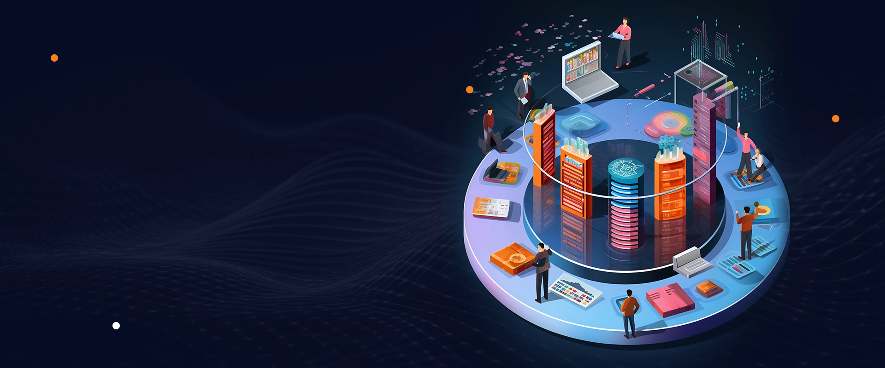
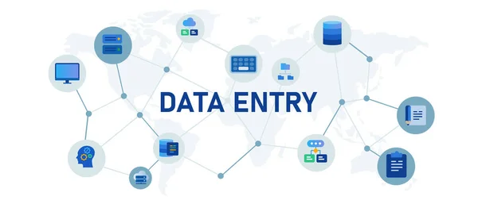
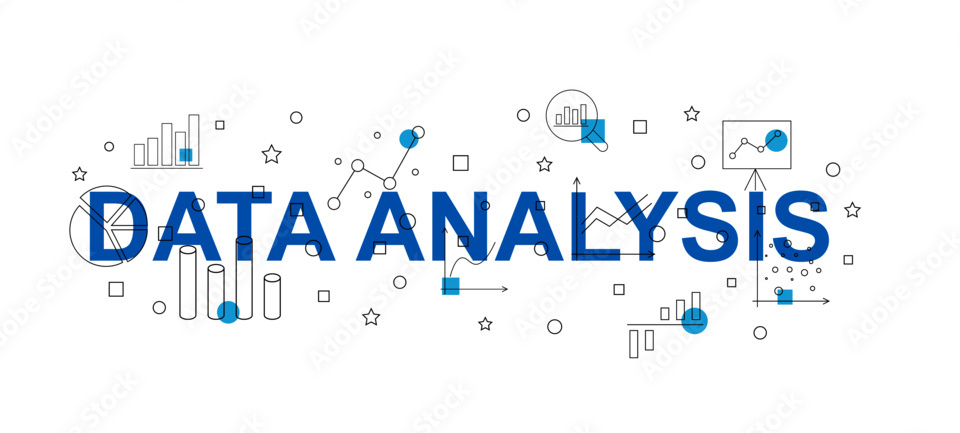

import { Badge } from '@astrojs/starlight/components';

<Badge text="#SQL" variant="danger" size="small" />
<Badge text="#Excel" variant="success" size="small" />
<Badge text="#Cheatset" variant="success" size="small" />
<Badge text="#bigdata" variant="success" size="small" />
<Badge text="#data-entry" variant="note" size="small" />
<Badge text="#data-analysis" variant="note" size="small" />

jadi sebelum masuk ke ke hal yang rumit yang bikin otak lu mumet kita mulai dulu dari sejarahnya terus dilanjut pengenalan software software yang sering dipake orang-orang diluar sana buat nganalisis data-data yang di dapetin dari database. 

### Sejarah
intinya dulu tuh pas abad ke 17 an awal-awal ada orang yang jago matematika ngebuat konsep analysis dasar, mereka tuh pake statistik dasar buat mahamin pola-pola kyak kematian,kelahiran,penyakit,demografi dan sosial,ini yang jadi kunci dimana abad-abad selanjutnya kyak abad ke-19 sampai abad 20 an muncul tuh software yang ngebantu orang-orang smart people ini ngitung-ngitung data,data-datanya nanti dipake buat apa?,ntar datanya bisa dipake buat nge prediksi suatu fenomena,contohnya kita ngumpulin data arus angin atau pergerakan awan,terus kita komputasi buat nge prediksi hujan,itu contoh salah satu data analisis yang paling simple buat kita pahamin,

nah terus pas udah ke abad 21 an udah mulai tuh yang namanya big data,gegara zaman udah modern kita ga mungkin ngrusin data-data yang cuma sekitar 10 atau 1000 data doang, teknologi juga makin canggih makanya standar buat jadi data analisis makin tinggi juga seiring dengan zaman,karna apapun passion yang berkaitan dengan teknologi kalo lu tinggalin aja sekali,besoknya udah jadi sistem baru lagi yang ga lu kenal,lanjut ke topik kita.

### Apa itu big data?
Big data tuh kayak lo punya sejuta info, tapi nggak cuma info receh kayak gosip seleb, tapi info penting yang bisa bikin lo jadi orang paling update dan bisa bikin keputusan yang tepat. Misalnya, lo bisa tahu tren fashion apa yang lagi hits, produk apa yang paling banyak dicari orang, atau bahkan prediksi siapa yang bakal menang pemilu. Jadi, big data tuh kayak lo punya kekuatan super buat ngerti dunia ini lebih dalem

### terus gimana cara ngumpulin big data?
biasanya big data di zaman modern kyak gini ngumpulin data-data costumer yang beli barang kita,mungkin lu pernah masuk ke website yang minta cookies buat lanjut ke website tersebut?,atau mungkin pernah liat iklan yang sama persis apa yang lu pengenin?,nah itu dia yang kita collect,biasanya kalo lu kerja di perusahaan lu bakal dikasih akses buat ngeliat aktifitas costumer lu (ga boong), jadi lu bisa tau costumer lu suka apa dan apa aja, tapi tenang aja itu ga lu pelototin 1 per 1 orangnya karna udah ada alatnya dimana nanti lu bisa cek datanya di database kyak SQL (Tempat store data).

jadi maksudnya gimana bang?,kok aku malah pusing,intinya lu tuh kerjaannya ada 2 fase
1. Data Entry
2. Data Analyst
nah sebenernya masih ada jadi data scientist tapi itu mah nanti.

jadi ngapain aja 2 fase tadi?

#### Data Entry
kyak namanya ,ini tuh kerjaan buat anak magang yang biasanya ngurusin data-data yang masuk,kerjaannya tuh kebanyakan ngurusin data-data yang ga rapih,ga sesuai atau invalid, buat skala kecil biasanya data entry ketemu pas lu jadi tukang warnet, biasanya bekas pembayaran lu langsung dimasukin ke data excel abang warnet biar nanti di setor ke bos nya berapa aja pemasukan terus nanti di kurangin sama pengeluaran,tapi ini masih kasarnya aja, ga kebayang kan lu harus benerin data 1 per 1 dimana datanya itu BIG DATA, makanya di fase ini juga fase yang paling ngehabisin waktu buat orang yang kerja jadi data entry,tapi gaji nya lumayan kok sekitar 3 jt an lebih ,apalagi kalo udah ngurusin data-data negara (asal jangan bocor)

### Data Analysis
jadi data analysis tuh bisa masuk jadi orang DKV alias desain grafis,karna urusannya jadi orang yang nunukin tabel-tabel grafik gitu dari bos,Keliatan mudah bukan?, Ya!,nyatanya tydaaakk, karna misalnya data nya itu berupa angka dan kita disuruh buat sebuah penjumlahan itu masih mending karna kita cuma butuh data yang sebelumnya di tambah dengan data yang lainnya,kek nyatuin lego lah gampangnya, tapi misalnya datanya udah termasuk data yang berupa teks alias data yang harus di analisis menggunakan modul contohnya nge analsis data responden pemain player ML dan HOK,bayangin berapa juta orang komentar terus lu liatin komen nya 1 per 1, ga mungkin kan lu bacain 1-1 ,kan?

nah disitu ada yang namanya tekonologi kakek buyut atau kerangka dari AI yang lu kenal skrng contohnya apa?,Chatgtp?,Gemini,Claude?,LLma?, yah intinya banyak gw juga udah mabok di cekokin AI mulu,intinya namanya neural network,yah lu ga perlu ampe cari tau ampe baca kisi-kisinya soalnya ini cuma tulisan yang ga tau ke pake apa kagak intinya ntar data lu di train dulu buat ngebedain mana yang koemntarnya positif mana yang negatif ntar udah dibandingin bakal ditunjukin kalkulasi hasil nya berapa banyak heter ML berapa banyak penggemar HOK.

inget sekali lagi ini yang kerjaannya bukan cuma pake tabel dasar loh ya,ini juga yang kerjaannya yang bikin tabel pivot,map sebaran sampe info graphic hasil data yang udah di analisis.

## Software
lu pasti tau dong excel, lu belajar TIK pas di sekolah di ajarin buat nulis rumus di excel terus liatin temen lu yang langsung ngisi jumlah nya 1-1  GA PAKE RUMUS, tapi itu dulu,sekarang zaman udah berubah, ini bukan era loe lagi (Younglex). sekarang data udah lebih dari 1000,bahkan excel aja ga bisa kita pake gegara datanya kegedean.makanya ini biasanya :
**Data Entry:**
1. Microsoft Excel
2. Google Sheets
3. Microsoft Access
4. SQL Server
5. MySQL
6. PostgreSQL
**Data Analysis:**
1. Microsoft Excel
2. Google Sheets
3. SPSS
4. SAS
5. R
6. Python
7. Tableau
8. Power BI
9. QlikView

mungkin reaksi lu **BUSET BANYAK BANGET A#G**  ,tenang!,dimana ada jalan disitu ada kemauan, itu juga kalo ada jalan. karna gw pinter sini gw ajarin biar lu bisa

