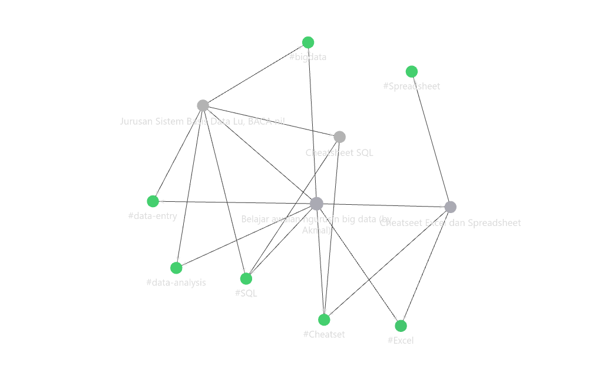
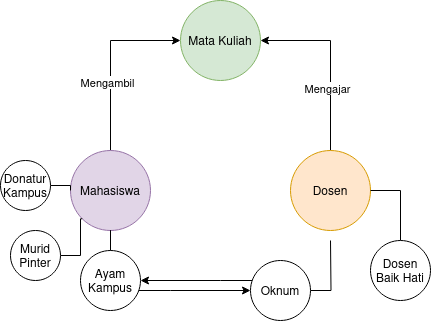
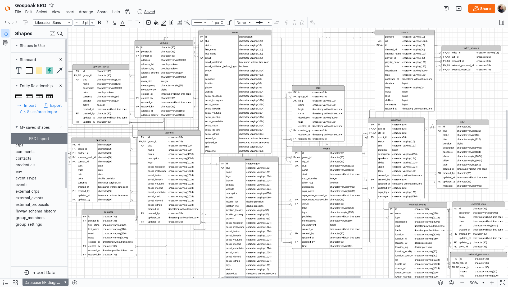
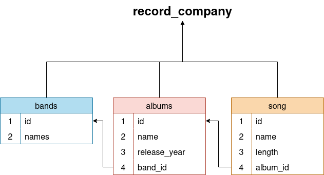

import { Badge } from '@astrojs/starlight/components';


<Badge text="#SQL" variant="danger" size="small" />
<Badge text="#data-analysis" variant="note" size="small" />
<Badge text="#bigdata" variant="success" size="small" />
<Badge text="#data-entry" variant="note" size="small" />
gw udah baca semua dokumen terkait jurusan lu
gw dapet simpulan lu bakal di asah dibagian 
- Pemograman SQL
- Baca isi database lewat ER Diagram
- Belajar make DBMS (_Database Management System_)
gw bakal bahas **Kok BASIS DATA PENTING SIH?**

# Kenapa Basis Data Penting
bayangin kamu punya banyak mainan. Kalau mainannya berantakan, pasti susah nyari yang kamu mau, kan? Nah, basis data itu kayak rak mainan yang rapi. Kita bisa nyimpen informasi penting dengan teratur, jadi gampang dicari dan dipakai lagi nanti.

jadi Basis Data atau kita singkat aja SBD (_Sistem Basis Data_) itu mirip perpustakaan yang besar yang nyimpen datanya di rak buku,nah lu bakal jadi *Penjaga Perpustakaan* ,lu yang bakal ngatur buku-buku genre apa aja yang masuk ke rak yang genre nya sesuai, gimana? udah sedikit paham?, tapi biasanya *Penjaga Perpustakaan* bakal dikasih **MAP/Denah** dari rak buku-buku kyak dimana rak yang genre horror berada atau genre Romantis seharusnya ada biar ga kesasar,**MAP/Denah** ini juga yang kita sebut ERD (_Diagram Hubungan Entitas atau entity relationship diagram_) ,gw juga bikin contoh gimana note ini terhubung satu sama lainnya lewat link 



dari gambar diatas keliatan kan mereka saling terikat satu sama lain karna ada _Suatu Hubungan_ nah ini yang disebut sebagai ERD, ini yang bakal nge map Data yang besar itu jadi suatu gelembung-gelembung gitu (Bisa beda-beda bentuknya kok), nah gw buatin contohnya relationship simple lu sama dosen 



Gimana?,keliatan simpel kan?,gimana sekarang kalo lu coba liat ini



ini contoh ERD dari Database Aplikasi,pernah coba Instagram,Facebook,atau aplikasi kyak Shoope?,nah yang di atas itu cuma rangka kecil dari aplikasi-aplikasi yang gw sebutin diatas,ini semua di map dijadiin beberapa kualifikasi contohnya buat _table user_ ada kolumn email ,password dan iduser,intinya yang bersangkutan sama user,jadi lu baca ginian biar ga pusing tips dari gw coba baca dulu judul tabel nya, baru lu cek bawahnya isinya data apa aja.

ini biasanya bakal kebentuk struktur kyak mapping gitu pas lu udah punya datanya,jadi anggap ini semua belum ada,kita mulai dari awal 

karna lu udah jago buat ngebaca tabel kita lanjut aja (Gw tau lu pura-pura paham)

## Apa itu SQL?
SQL (_Structured Query Language_) itu bahasa pemrograman standar yang dipake buat mengelola dan memanipulasi data dalem sistem manajemen basis data relasional (RDBMS). Dengan SQL, kamu bisa ngelakuin banyak operasi kyak membuat, mengubah, menghapus, dan mengambil data dari database.

lu juga bisa baca cheatsheet dibawah buat tau perintah gimana programnya bisa jalan
- [Cheatsheet_SQL.pdf](https://raw.githubusercontent.com/pavry/Cheat-Sheet-for-Data-Analysts/master/Data%20Analyzing/SQL/SQL%201.pdf)
- [Cheathseet SQL lagi.pdf](https://github.com/pavry/Cheat-Sheet-for-Data-Analysts/raw/master/Data%20Analyzing/SQL/SQL%202.pdf)
- [Gambar cheatsheet](https://github.com/pavry/Cheat-Sheet-for-Data-Analysts/blob/master/Data%20Analyzing/SQL/SQL%203.png)

Fun fact: SQL punya banyak varian seperti
- MySQL
- SQLite
- PostreSQL
- Oracle
,di empat diatas yang biasanya sering dipake buat jadi SQL dasar di aplikasi-aplikasi/website yang dimana nanti lu bakal belajar buat backend server yang bisa ke sambung sama website lu pke REST API,walaupun varian SQL itu banyak tapi cara memanggil perintahnya tetap sama cuma beberapa sistem logic pencarian atau tambahannya itu tergantung varian itu sendiri, gw bakal kasih contoh maksudnya tambahanya
- PostreSQL 
	- ini termasuk SQL paling nyaman soalnya ada banyak banget ekstensi yang ada di dalemnya ,contohnya text-search by vector ,intinya lu bisa cari kalimat yang hamir mirip di database contohnya misal ada kalimat kyak "Kucing mengejar tikus","Tikus makan keju", dan "Buah jatuh", nanti hasil vector nya kalau kita buat grafik dari kalimat yang kita cari bakal ada 2 item yang lebih relevan karena kucing dan tikus mempunyai korelasi yang sama. ini biasanya dipake buat text search modern di website atau aplikasi,jadi mau lu typo juga hasil search nya bukan diliat dari "=" persamaan kalimat yang lu tulis melainkan vector(Hitungan intinya) yang dicari buat nemuin variabel yang mendekati,dari sini kalau kita lanjut lebih jauh lagi lu bakal masuk ke machine learning dan AI sangat bersangkutan banget loh sama DATABASE apalagi big data karna kepanjangan LLMA adalah Large language model jadi ga heran lu bakal ketemu hal-hal yang diluar sana bisa sejauh bintang 
- SQLite
	- Dari namanya SQLite sendiri punya struktur paling ringan,beda kyak PostreSQL,SQLite lebih cocok buat kyak aplikasi-aplikasi didalemnya contohnya database local,SQLite saking ringannya lu bisa bayangin aja buat nge running nya lu cuma butuh berapa detik buat ngejalanin database nya secara lokal, dan memang adanya kelebihan pasti ada kekurangan, SQLite ga punya banyak ektensi lebih banyak dari PostreSQL, tapi kalau lu orangnya minimalis coba pake .

dari itu semua yang paling basic tentu nya **MySQL** ,bukan cuma mudah dan ga ribet,penggunaannya juga termasuk ringan .

:::tip[Sekilas]
> biar lu ga bingung buat lanjut ,inget buat liat dulu cheatsheet nya di [Cheatsheet SQL.pdf](https://raw.githubusercontent.com/pavry/Cheat-Sheet-for-Data-Analysts/master/Data%20Analyzing/SQL/SQL%201.pdf)
:::
dari sini ayo kita mulai

### Belajar Mengoprasikan SQL
pertama-tama misalnya lu belum mau masuk ke CLI alias main ke terminal kyak yang gw lakuin,lu bisa coba website-website penyedia database,ada firebase buatan dari google ,astroDB buat framework astro atau gw rekomend banget buat lu paham gimana database itu bekerja coba pake Supabase,selain dia nge gunain PostreSQL ,dia juga udah bisa nge hosting database lu online terus udah disiapin semua nya dari Rest API nya yang bisa lu panggil ke codingan lu misalnya lu mau buat website yang ada login page nya(Semua website/aplikasi yang ada login page nya artinya mereka pasti punya backend yang ngatur data-data lu,jadi kerjaan SQL ini biasanya nyimpen akun lu ke database terus nge encrypt/ngejaga biar Database lu ga di bobol,makanya gw nyaranin supabase karna udh ada pengamanan nya sama monitoring berapa kali database lu di hit).jadi buat sekarang gw bakal kasih contoh 
- [Data SQL](../../../assets/'data(1).sql')
- [schema sql](../../../assets/schema.sql')

di atas ada 2 file yang bentuk nya SQL,ini bentukan asli misalnya data lu distore dan jadi file,entah gimana gw bilangnya ,nanti gw jelasin. 

sekarang kita liat dulu hal penting yang ada di Data:
```sql
INSERT INTO bands(id,name) VALUES (1,'Seventh Wonder');
INSERT INTO bands(id,name) VALUES (2,'Metallica');
INSERT INTO bands(id,name) VALUES (3,'The Ocean');
INSERT INTO bands(id,name) VALUES (4,'Within Temptation');
INSERT INTO bands(id,name) VALUES (5,'Death');
INSERT INTO bands(id,name) VALUES (6,'Van Canto');
INSERT INTO bands(id,name) VALUES (7,'Dream Theater');
```

nah command di atas tuh gimana si sql nge masukin Collumn ,disini ada 2 Column id dan name yang di buat di table yang namanya "bands",contohnya kek gini

| id  | name              |
| --- | ----------------- |
| 1   | Seventh Wonder    |
| 2   | Metallica         |
| 3   | The Ocean         |
| 4   | Within Temptation |
| 5   | Death             |
| 6   | Van Canto         |
| 7   | Dream Theater     |
apa disini udah sedikit paham?,oke sekarang kita lanjut baris kode selanjutnya
```sql
INSERT INTO albums(id,name,release_year,band_id) VALUES (1,'Tiara',2018,1);
INSERT INTO albums(id,name,release_year,band_id) VALUES (2,'The Great Escape',2010,1);
INSERT INTO albums(id,name,release_year,band_id) VALUES (3,'Mercy Falls',2008,1);
INSERT INTO albums(id,name,release_year,band_id) VALUES (4,'Master of Puppets',NULL,2);
INSERT INTO albums(id,name,release_year,band_id) VALUES (5,'...And Justice for All',1988,2);
INSERT INTO albums(id,name,release_year,band_id) VALUES (6,'Death Magnetic',2008,2);
INSERT INTO albums(id,name,release_year,band_id) VALUES (7,'Heliocentric',2010,3);
INSERT INTO albums(id,name,release_year,band_id) VALUES (8,'Pelagial',2013,3);
INSERT INTO albums(id,name,release_year,band_id) VALUES (9,'Anthropocentric',2010,3);
INSERT INTO albums(id,name,release_year,band_id) VALUES (10,'Resist',2018,4);
INSERT INTO albums(id,name,release_year,band_id) VALUES (11,'The Unforgiving',2011,4);
INSERT INTO albums(id,name,release_year,band_id) VALUES (12,'Enter',1997,4);
INSERT INTO albums(id,name,release_year,band_id) VALUES (13,'The Sound of Perseverance',1998,5);
INSERT INTO albums(id,name,release_year,band_id) VALUES (14,'Individual Thought Patterns',1993,5);
INSERT INTO albums(id,name,release_year,band_id) VALUES (15,'Human',1991,5);
INSERT INTO albums(id,name,release_year,band_id) VALUES (16,'A Storm to Come',2006,6);
INSERT INTO albums(id,name,release_year,band_id) VALUES (17,'Break the Silence',2011,6);
INSERT INTO albums(id,name,release_year,band_id) VALUES (18,'Tribe of Force',2010,6);
```

"Waduh panjang banget",mungkin itu yang lu pikirin,tapi coba lu cek satu perintah ini :
```sql
INSERT INTO albums(id,name,release_year,band_id) VALUES (1,'Tiara',2018,1);
```
disitu kode _INSERT INTO_ adalah perintah buat ngemasukin data ke table yang namanya "albums",nah coba kita liat perintah sehabis albums
```sql
(id,name,release_year,band_id)
```
ini tuh judul dibagian atas tabel,lu bakal paham deh pas lu udah liat bentuk tabel nya kyak gini:

| id  | name                        | release_year | band_id |
| --- | --------------------------- | ------------ | ------- |
| 1   | Tiara                       | 2018         | 1       |
| 2   | The Great Escape            | 2010         | 1       |
| 3   | Mercy Falls                 | 2008         | 1       |
| 4   | Master of Puppets           | NULL         | 2       |
| 5   | ...And Justice for All      | 1988         | 2       |
| 6   | Death Magnetic              | 2008         | 2       |
| 7   | Heliocentric                | 2010         | 3       |
| 8   | Pelagial                    | 2013         | 3       |
| 9   | Anthropocentric             | 2010         | 3       |
| 10  | Resist                      | 2018         | 4       |
| 11  | The Unforgiving             | 2011         | 4       |
| 12  | Enter                       | 1997         | 4       |
| 13  | The Sound of Perseverance   | 1998         | 5       |
| 14  | Individual Thought Patterns | 1993         | 5       |
| 15  | Human                       | 1991         | 5       |
| 16  | A Storm to Come             | 2006         | 6       |
| 17  | Break the Silence           | 2011         | 6       |
| 18  | Tribe of Force              | 2010         | 6       |
nah mungkin udah sedikit paham cara kerjanya gimana cara kebentuk,sekarang ayo coba kita baca schema nya gimana

*Sebenernya gw harus ngajarin dulu gimana schema bisa jalan,tapi gw pengen lu paham dulu gimana data masuk*

```sql
CREATE DATABASE record_company;
USE record_company;

CREATE TABLE bands (
  id INT NOT NULL AUTO_INCREMENT,
  name VARCHAR(255) NOT NULL,
  PRIMARY KEY (id)
);

CREATE TABLE albums (
  id INT NOT NULL AUTO_INCREMENT,
  name VARCHAR(255) NOT NULL,
  release_year INT,
  band_id INT NOT NULL,
  PRIMARY KEY (id),
  FOREIGN KEY (band_id) REFERENCES bands(id)
);
```

nah sebenernya sebelum data itu dibuat kita harus buat dulu schema tabel itu,kenapa?,karna ga mungkin kita masukin data ke table yang belum ada tablenya buka?
sekarang coba kita baca dulu baris 1 sama 2 :
```sql
CREATE DATABASE record_company;
USE record_company;
```
disini kita ngebuat database baru di sql yang namanya _record_company_ ,terus gunanya **USE** itu artinya kita kyak nge double click folder gitu buat masuk ke folder _record_company_ ,kita lanjut ke baris selanjutnya :
#### Tabel Bands
```sql
CREATE TABLE bands (
  id INT NOT NULL AUTO_INCREMENT,
  name VARCHAR(255) NOT NULL,
  PRIMARY KEY (id)
);
```

disini kita ngebuat table yang namanya bands **tapi** disini kita liat line selanjutnya nyebutin nama column yang tadi kan?, **id** sama **name** . di text bisa kita bedah jadi kyak gini
```sql
id INT NOT NULL AUTO_INCREMENT,
```
-  ```id``` buat nama column
- ```INT``` int artinya tipe data yang di store bakal berupa angka dan harus angka INT juga bisa kita sebut integer
- ```NOT NULL``` not null sendiri artinya isi data di column ga boleh ada yang kosong atau null
- ```AUTO_INCREMENT``` artinya value id bakal nge generate id unik yang nambah 1 angka setiap data dimasukin
```sql
name VARCHAR(255) NOT NULL
```
- ```name``` buat nama column
- ```VARCHAR(255)``` artinya tipe data yang distore bakal berupa text terbatas sampe 255 character
- ```NOT NULL``` sama kek diatas ya nyet,ga boleh kosong
```sql
PRIMARY KEY (id)
```
- ```PRIMARY KEY``` ini tuh kyak kata kuncinya,nah kenapa ada variabel (id)?,karna variabel id bakal ngeluarin value unik yang ga mungkin sama kyak data yang lainnya, coba aja kalo primary key nya kita masukin ke column name,bisa aja ada yang nama band nya sama ,makanya primary key harus unik dan ini wajib di tambahin,lu bisa milih banyak variabel key selain id kok sesuai selera aja mau di taro ke name juga,tapi pas masukin data,inget varibael nya harus sama persis,dan itu yang bikin pusing nantinya,makanya id lebih enak karna dia bakal nge generate otomatis

sekarang kita lanjut ke kode sql yang berikutnya yaitu albums,yuk kita bedah
#### Tabel albums
```sql
CREATE TABLE albums (
  id INT NOT NULL AUTO_INCREMENT,
  name VARCHAR(255) NOT NULL,
  release_year INT,
  band_id INT NOT NULL,
  PRIMARY KEY (id),
  FOREIGN KEY (band_id) REFERENCES bands(id)
);
```

```sql
id INT NOT NULL AUTO_INCREMENT,
```
-  ```id``` buat nama column
- ```INT``` int artinya tipe data yang di store bakal berupa angka dan harus angka INT juga bisa kita sebut integer
- ```NOT NULL``` not null sendiri artinya isi data di column ga boleh ada yang kosong atau null
- ```AUTO_INCREMENT```intinya masih sama ya
```sql
name VARCHAR(255) NOT NULL
```
- ```name``` buat nama column
- ```VARCHAR(255)``` artinya tipe data yang distore bakal berupa text terbatas sampe 255 character
- ```NOT NULL``` sama kek diatas ya nyet,ga boleh kosong
```sql
release_year INT,
```
- ```release_year``` buat nama column nya ini ye inget
- ```INT``` sama kyak di atas int disini maksudnya integer artinya value harus berupa numerik dan gaboleh isinya variabel character
```sql
PRIMARY KEY (id)
```
- ```PRIMARY KEY``` lu juga udah paham ,kalo nggak baca lagi keatas apaan primary key
```sql
FOREIGN KEY (band_id) REFERENCES bands(id)
```
- ```FOREIGN KEY``` Nah ini yang baru, karna yang sebelumnya kita nge bahas _Primary Key_ sedangkan sekarang malah muncul istilah baru kyak _Foreign Key_ ,nah si foreign key ini kyak namanya artinya dia minta kunci diluar tabel ini,contihnya disini foreign key minta data dari tabel bands yang udah pernah kita buat diatas,cara kerjanya sama kok sama primary jey,misalnya data nya ga sama kyak band id di bands maka data bakal invalid 

mungkin lu udah sedikit paham cara kerjanya tabel schema ini, nanti ini bakal ngebentuk 



tungguuuu dulu!!!, sebelum itu coba cek table song yang ada di table,kita belum buat kodenya dan sekarang waktunya 
#### LATIHAN!

1. buatkan kode SQL buat ngebentuk table `song` 
2. buat tabel di tabel bands untuk kolumn `name` menjadi `bands_name` 
3. plih data di  tabel `albums` untuk albums terlama (the oldest albums)
4. Return table untuk setiap `bands_name` yang memiliki albums
5. Return table untuk setiap `bands_name` yang tidak memiliki albums
6. Return album yang punya durasi paling lama ,return `name` , `release_year`, dan `duration`